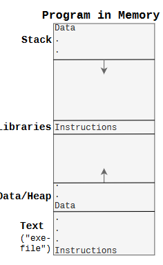

# Chapter 1

## 1.1 Computer Architecture

#### CPU, Memory, I/O Devices


- CPU: - the brain of the computer
  - ALU: Arithmetic Logic Unit - performs arithmetic and logical operations on
    binary numbers
  - MMU - Memory Management Unit - responsible for managing memory accesses
  - CU - Control Unit - controls the data flow and prepares stuff for ALU to execute
  - Registers - small, fast storage locations in the CPU
    - AX. BX, CX. DX. SP. BP. SI, DI Data Registers - stores variables,
      arguments and return values etc.
    - IP/PC - Instruction Pointer/Program Counter - stores the address of the
      next instruction to be executed
    - IR - Instruction Register - stores the current instruction being executed
      by ALU
    - SP - Stack Pointer - points to the top of the stack
    - BP - Base Pointer - points to the base of the stack; a stack frame is
      created for each function call and deleted when the function returns
    - FLAG/PSW - Flag Register/Program Status Word - contains control/status
      information about the CPU
- Memory/RAM - Random Access Memory - running programs are loaded here and they
  contain instructions and data. _Every address into memory goes to a Byte, not
  a bit or a word_
- I/O-devices - are connected to the computer's central bus and are used by the
  CPU to get info out and in of the computer.

### 1.1.1 Register


A register can be used in 8-bit, 16-bit, 32-bit or 64-bit mode.
**If it starts with:**

- R - 64-bit (e.g. RAX, RIP, RSP)
- E - 32-bit (e.g. EAX, EIP, ESP)
  We rarely see 16- and 8-bit registers in modern computers.

### 1.1.2 ISA (Instruction Set Architecture / Microarchitecture)

- native data types and instructions that a processor can execute
- registers
- addressing modes
- memory architecture
- interrupt and exception handling
- external I/O

Each ISA has a specific set of instructions it can execute.

We are interested in what we can use directly to program on the lowest possible
level -> we use the symbolic representation of the machine instructions:
**Assembly code.**

#### Regular instructions

The most common instructions are:

- Move/Copy data `mov`
- Math functions `add`, `sub`
- Function related `call`, `ret`
- Jumping `jmp`, `je` (jump if equal), `jne` (jump if not equal)
- Comparing `cmp`
- Stack related `push`, `pop`

### 1.1.3 How CPU works

CPU Workflow (simplified):

```c
while(not HALT) { # while powered on
  IR=Program[PC]; # fetch instruction pointed to by PC to IR
  PC++; # increment PC (program counter aka IP)
  execute(IR); # execute instruction in IR
}
```

Instruction cycle: _fetch, (decode), execute_

### 1.1.4 Interrupts

CPU Workflow - with interrupts:

```c
while(not HALT) {
  IR = mem[PC]; # IR = Instruction Register
  PC++; # PC = Program Counter (register)
  execute(IR);
  if(IRQ) { # IRQ = Interrupt ReQuest
    savePC();
    loadPC(IRQ); # Hopper til Interrupt-rutine
  }
}
```

I/O devices will generate an _interrupt_ to the CPU when they want the
attention. Then the CPU will stop what it's doing and execute a specific piece
of code to handle the interrupt. Since they can happen at any time, they are
called _asynchronous interrupts_.

**Registers vs RAM** Register contents _belong to the current running program
and the OS_

#### A Program in Memory



- **Text** - contains the program's instructions
- **Data/Heap** - (grows upwards)- contains _global variables, local static
  variables_ (e.g. `static int x:`) _dynamically allocated memory (e.g. `malloc`)_

- **Libraries** - e.g. _libc_. We actually _point to the library_ because all
  the programs would share this library in memory to **save space**.

- **Stack** - (grows downwards) - contains _local automatic variables, return
  addresses_ and sometimes _function arguments_.

**_NOTE:_** If _grows upwards_ -> addresses increase, if _grows downwards_ ->
addresses decrease; such that the stack and heap don't collide. If the both meet
-> the program will crash. To maximize the available memory.

## 1.2 Software

### 1.2.1 Compiling

**Abstraction levels** refer to the shift between programming languages
created for humans and those created for machines.

### 1.2.2 _gcc_

Is our compiler and will output assembly code with the `-S` flag.

### 1.2.3 32 vs 64 bit

Difference in instructions (q(quadword) suffix for 64-bit, l (long) suffix
for 32-bit) and registers (`rbp` for 64-bit, `ebp` for 32-bit).

### 1.2.4 Syntax

Assembly code is translated to machine code by the assembler (e.g. _GAS_)

```asm
  file " asm -0 .c " # DIRECTIVES
  .text
  .globl main

  main : # LABEL

  push rbp # INSTRUCTIONS
  mov rsp , rbp
  mov 0 , eax
  ret
```

- `file "asm-0.c"` - meta info that says which source code is the origin of
  this code.
- `.text` - states that the following is the program code
- `.globl main` - makes the `main` function visible to the linker
- `main:` - a label that can be used to reference this location in the code
- `push rbp` - puts the baste pointer (aka frame pointer) on the stack
- `mov rsp, rbp` - sets base pointer (register rbp) equal to stack pointer
  (register rsp)
- `mov 0, eax` - sets a "general purpose register" (eax) to 0 (return value
  of main function)
- `ret` - pops the return address from the top of the stack into IP which
  causes the program to continue from where it was called

Instruction/opcode is called a mnemonic
mnemonic suffix b (byte), w (word), l (long), q (quadword)
operand is an argument
operand prefix % is a register, $ is a constant (a number)
address calculation `movl -4(%ebp), %eax`
“load what is located in address(ebp − 4) into eax”

### 1.2.5 Examples

_parentheses around a register means that we are accessing memory at the
address which is stored in the register_

_arguments seven or higher are pushed onto the stack instead of being stored in
registers (e.g. edi, esi)_

The area of the stack that a function uses is called a **stack frame**, and
consists of: _return address, arguments, local variables, saved registers_ -
(between the base pointer and the stack pointer)

## 1.3 CPU terminology

Important terms:

- Clock speed/rate - the number of clock cycles per second
- Pipeline, Superscalar - techniques to execute multiple instructions at the same time
- Machine instructions into Micro operations - the CPU breaks down the machine instructions into micro operations
- Out-of-order execution - the CPU can execute instructions out of order

1GHz = 1 billion cycles per second = each such pulse pushes the execution of the
instruction one step further

### 1.3.1 Pipeline/Superscalar


The execution of an instruction is broken down into multiple steps (micro
operations). I.e. add two numbers:

1. (fetch) Fetch the instruction from memory
2. (decode) Decode it, what instruction is it?
3. (decode) Place numbers to be added in the correct registers
4. (execute) Add the numbers
5. (execute) Store the result in a register

To make CPU as efficient as possible, one therefore creates separated units in
which each of these micro operations are performed (_(a)_ in figure above,
**pipeline**)

For even more efficient approach, one can duplicate these units, so that multiple instructions can be executed at the same time (_(b)_ in figure above, **Superscalar**)

Modern computers are commonly Superscalar CPUs.

Such CPU can also execute instructions **out-of-order-execution**, if it can be done without affecting the result.

The control logic tries to keep most of the execution units busy as much as possible.

Modern processors also perform **speculative execution**, i.e. they try to guess
what will be the outcome of **branch instructions** (e.g. a jump instruction)
and then reverse if it went wrong.

Both out-of-order-execution and speculative execution are techniques to increase
performance.


An extension of the superscalar concept is **Simultaneous Multi-Threading
(SMT)** or **Hyper-Threading (HT)**. This is a technique where the CPU appears to the OS as two separate CPUs. The CPU has two sets of registers and can execute two threads at the same time. This is done by duplicating the pipeline stages and the execution units. This technique is used in Intel's CPUs.

## 1.4 Cache

Accessing RAM is incredibly slow compared to the speed of the CPU registers. The
hardware will try to go RAM when it really has to. It can do this by two
means:

1. "_remember_" the data/instructions that has recently been fetched from RAM
   (temporal locality)
2. fetch more than just the bytes you need from RAM and "remember" this as well

**The place we "remember" this is the CPU cache. (much faster, but not as fast
as register)**

### 1.4.1 Why Cache?


The _bottleneck_ that occurs between the speed of the CPU and the time it takes
to do it memory access is often referred to as the **von Neumann bottleneck**,
and in practice solved with the cache mechanism.

CPU caches have multiple levels (commonly **L1, L2, L3**), and sometimes a level
of the cache is split into two parts, one for data and one for instructions
(L1).

Smallest we can retrieve from memory is a Byte, but we never cache just a single
Byte, we cache a **cache line** (64 Bytes in modern CPU).

**Cache makes programs run faster** because instructions are frequently reused
(co-located in time) while data is often accessed blockwise (co-located in
space)

_Zooming in on memory_:


_cache line_ - typically 64 bytes

### 1.4.2 Write Policies

**Write-through** - write to cache line and immediately to memory

**Write-back** - write to cache line and mark cache line as _dirty_ (i.e. contains data that has not been written to the next level data
storage (RAM or a slower cache level) yet.)

With _write-back_ the data is only written to memory when the cache line is to
be over-written by another or in other cases such as **context switch** (to
replace the running program on the CPU: stop the program, save the program's
state and start another program).

A challenge arises when there are multiple CPU cores present: _what if they have
cached the same data? How does one processor core know that no other processor core has written to same the data it has cached?_ This is solved by **cache coherence protocols** like MESI (but gets more complex and expensive).

#### Write-through


#### Write-back


With write-back caching, we have to check whether the cache block (cache line) we
want to write to is dirty. This applies to both read and write requests.
Write through caching is the simplest and safest (since caching will only contain a copy
of data that exists elsewhere), but if we want the system to give good performance for
write requests (which we in most cases do), then we must use write-back caching

_When context switching, the cache is full of data from the previous program,
and it takes time to replace it with new data (-> we need to "warm up the cache"), hence we say that a context switch is expensive_

## 1.5 Review Questions

1. What is a "Directive" in Assembly code?
   -> They are meta-information that the assembler uses to understand the code (e.g. `.text`, `.globl main`)
   -> One important use could be declaring or reserving memory variables.
2. Superscalar and pipeline
   -> pipeline means breaking down execution of an instruction into multiple steps (micro operations)
   -> superscalar means duplicating these units so that multiple instructions can be executed at the same time
3. What does a C-compiler like gcc do? What is the difference between C-code, assembly code and machine code?
   -> gcc compiles C code into assembly code, which is then assembled into machine code by the assembler.

4. (KEY PROBLEM) Based on the examples of C-code and assembly code we have
   covered in this chapter, explain what each line in the following assembly code
   does:

```asm
01 .text
02 .globl main
03 main:
04 pushq %rbp
05 movq %rsp, %rbp
06 movl $0, -4(%rbp)
07 jmp .L2
08 .L3:
09 addl $1, -4(%rbp)
10 addl $1, -4(%rbp)
11 .L2:
12 cmpl $9, -4(%rbp)
13 jle .L3
14 movl $0, %eax
15 popq %rbp
16 ret
```

1. `.text` - states that the following is the program code (text section)
2. `.globl main` - makes the `main` function visible to the linker (global)
3. `main:` - a label that can be used to reference this location in the code
4. `pushq %rbp` - puts the base pointer (aka frame pointer) on the stack
5. `movq %rsp, %rbp` - sets base pointer (register rbp) equal to stack pointer (register rsp)
6. `movl $0, -4(%rbp)` - sets a "local automatic variable" to 0 in -4(%rbp) (local variable)
7. `jmp .L2` - jump to label .L2
8. `cmpl $9, -4(%rbp)` - compare the value in -4(%rbp) with 9 (checks if %rbp
   <= 9 which is true in this case) Sign Flag is true now.
9. `jle .L3` - jump to label .L3 if the previous comparison was less than or
   equal (true)
10. `addl $1, -4(%rbp)` - add 1 to the value in -4(%rbp) (increment by 1)
11. `addl $1, -4(%rbp)` - add 1 to the value in -4(%rbp) (increment by 1)
12. `movl $0, %eax` - sets a "general purpose register" (eax) to 0 (return value of main function)
13. `popq %rbp` - pops the base pointer from the stack (removes the stack frame)
14. `ret` - pops the return address from the top of the stack into IP which
    causes the program to continue from where it was called

```c
int main() {
    int x = 0;
    while(x <= 9) {
        x++;
        x++;
    }
    return 0;
}
```
