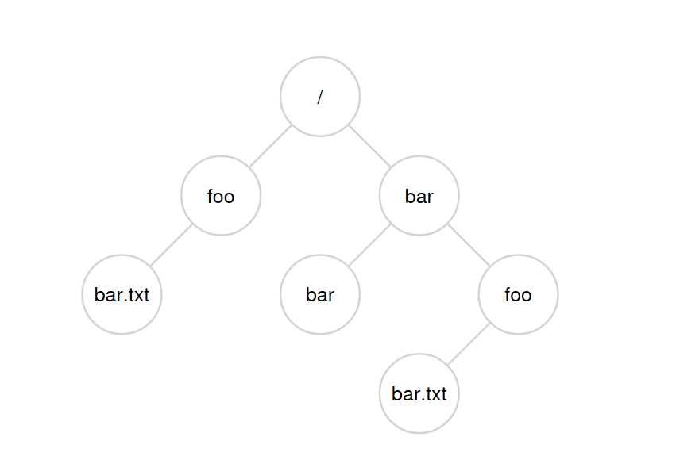
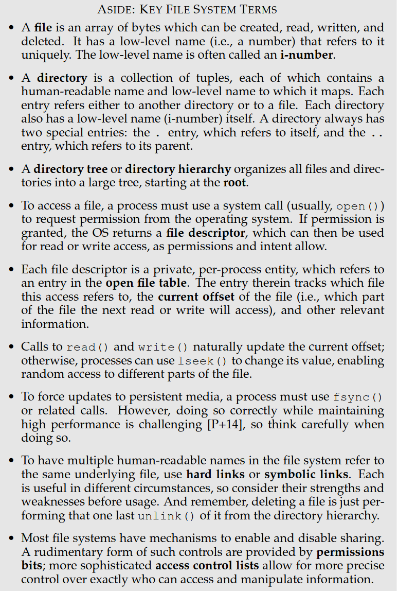
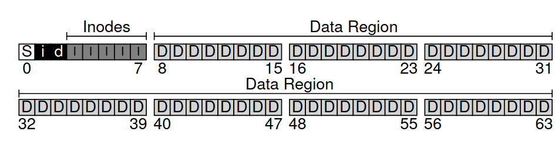
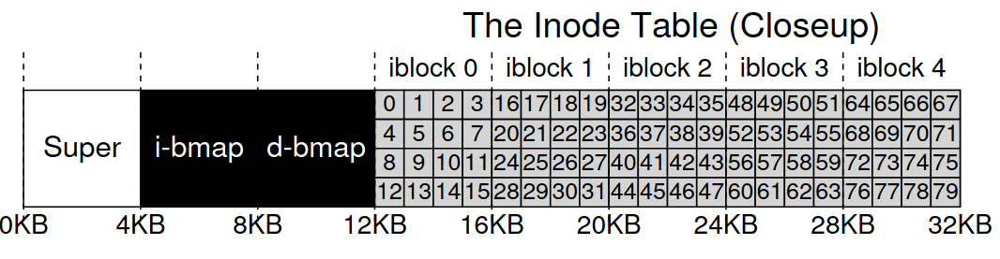
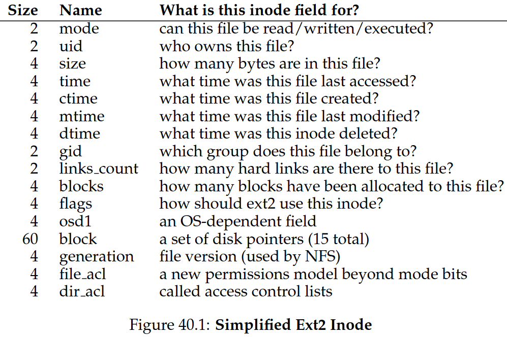
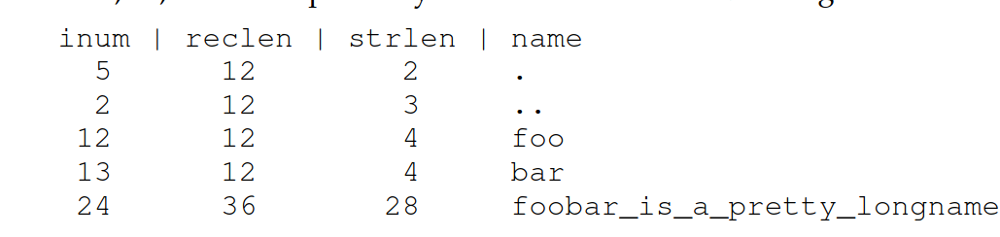
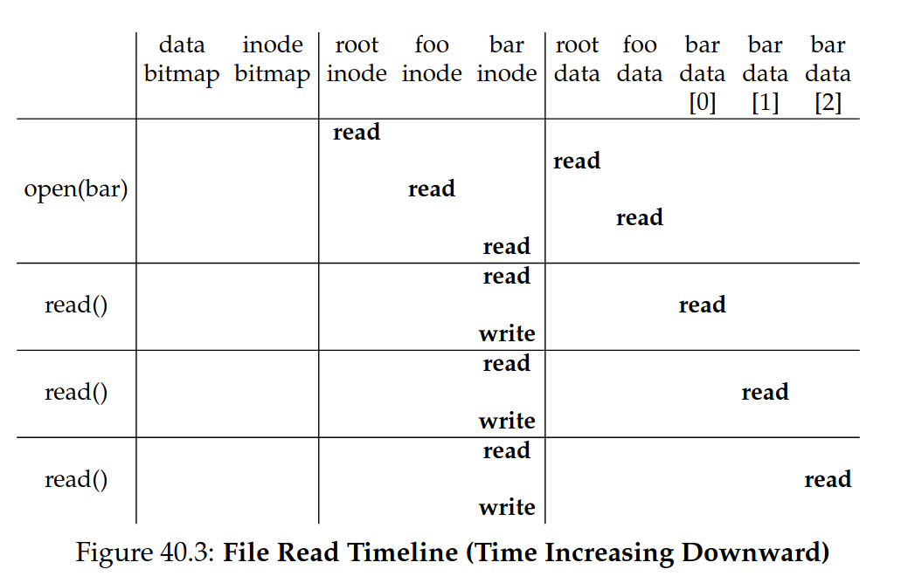
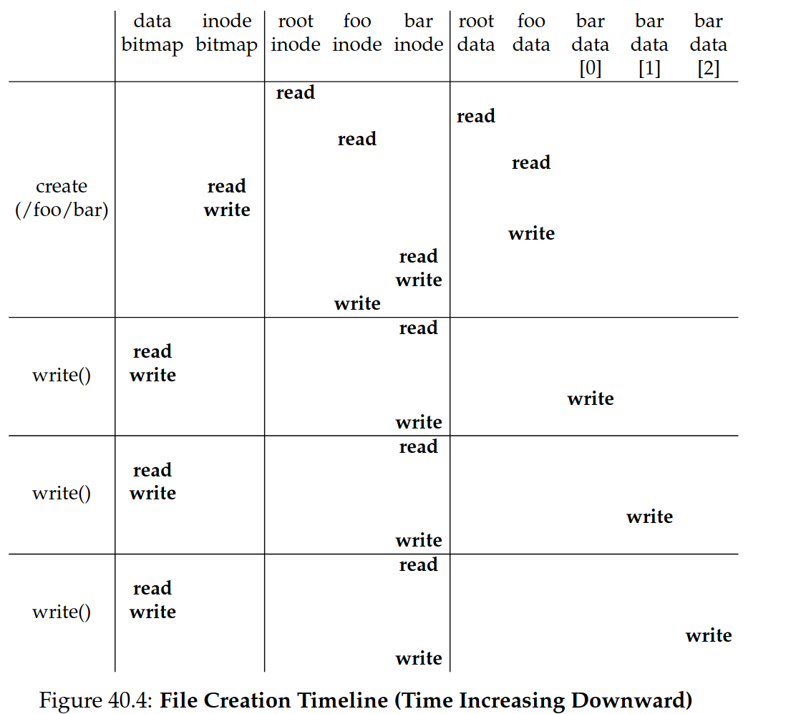
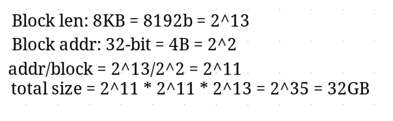
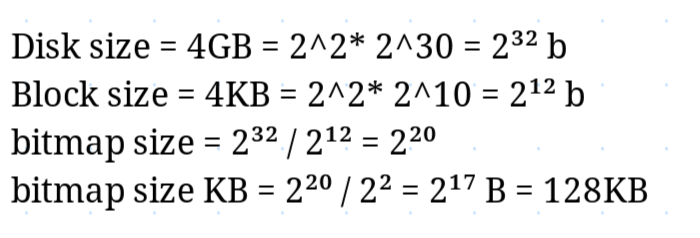

# 10. File Systems

inode, open(), read(), write(), close(), STDIN/STDOUT/STDERR, file descriptor, fsync, metadata, strace, link/unlink, mkdir(), opendir(), readdir(), closedir(), rmdir(), hard link, symbolic link, permission bits (rwx), SetUID, SetGID, sticky bit, chmod(), chown(), mkfs, mount, inode/data bitmap, metadata, superblock, single/double/triple indirect pointers/addressing, extents, EXT, page cache, sleuthkit, fsck, journalling, idempotent

> Now we need one more virtualisation: **Persistent storage**

## 10.1 Files and Directories

_Two key abstractions_: **File** and **Directory**

**file**: a linear array of bytes, and it has some kind of _low-level_: **inode number**.
**directory**: contains a list of (`user-readable-name`, `inode-number`) pairs. It also has an inode number.


In Unix-based systems, the **root-directory** starts at `/`

### 10.1.1 API

**open**:

```c
int fd = open("foo", O_CREAT|O_WRONLY|O_TRUNC,
S_IRUSR|S_IWUSR);

```

- `O_CREAT`: create the file if it doesn't exist
- `O_WRONLY`: open for writing
- `O_TRUNC`: truncate the file to zero length
- `S_IRUSR`: owner has read permission
- `S_IWUSR`: owner has write permission

### 10.1.2 File Descriptors

This returns a file descriptor `fd`:

- used to access the file
- _private_ to the process
- stored in a per-process structure (proc)

There are three reserved file descriptors:

- `0`: standard input
- `1`: standard output
- `2`: standard error

cat:

```bash
prompt> strace cat foo
...
open("foo", O_RDONLY|O_LARGEFILE) = 3
read(3, "hello\n", 4096) = 6
write(1, "hello\n", 6) = 6
hello
read(3, "", 4096) = 0
close(3) = 0
...
prompt>
```

### 10.1.3 Sync

A call to `write` doesn't actually write to the disk immediately. It writes to the **page cache**. To force the write to the disk, use `fsync`:

```c
int fd = open("foo", O_CREAT|O_WRONLY|O_TRUNC,
S_IRUSR|S_IWUSR);
assert(fd > -1);
int rc = write(fd, buffer, size);
assert(rc == size);
rc = fsync(fd);
assert(rc == 0);
```

### 10.1.4 Metadata

We can use the `stat` tool for metadata

```bash
prompt> echo hello > file
prompt> stat file
File: ‘file’
Size: 6 Blocks: 8 IO Block: 4096 regular file
Device: 811h/2065d Inode: 67158084 Links: 1
Access: (0640/-rw-r-----) Uid: (30686/remzi)
Gid: (30686/remzi)
Access: 2011-05-03 15:50:20.157594748 -0500
Modify: 2011-05-03 15:50:20.157594748 -0500
Change: 2011-05-03 15:50:20.157594748 -0500
```

To remove a file, use `unlink`:

```bash
prompt> strace rm foo
...
unlink("foo") = 0
...

```

### 10.1.5 Directories

We cannot write to a directory, because it's considered metadata.

```bash
prompt> strace mkdir foo
...
mkdir("foo", 0777) = 0
...
prompt>
```

### 10.1.6 Links

#### Hard Links

> A hard link is a directory entry that points to the same inode as another directory entry.

```bash
prompt> echo hello > file
prompt> cat file
hello
prompt> ln file file2
prompt> cat file2
hello
```

#### Symbolic Links

> A symbolic link is a file that contains the name of another file.

```bash
prompt> echo hello > file
prompt> ln -s file file2
prompt> cat file2
hello
prompt> rm file
prompt> cat file2
cat: file2: No such file or directory
```

### 10.1.7 Access Control

```bash
prompt> ls -l foo.txt
-rw-r--r-- 1 remzi wheel 0 Aug 24 16:29 foo.txt
```

`r`: read, `w`: write, `x`: execute

- first three: owner (`rw-`)
- second three: group (`r--`)
- third three: everyone else (`r--`)

**SetUID**: when a file is executed, it runs with the permissions of the file's owner.

**SetGID**: when a file is executed, it runs with the permissions of the file's group.

**Stick bit**: only the owner of the file can delete it.

### 10.1.8 `mkfs` and `mount`

`mkfs`: create a file system on a disk
`mount`: attach a file system to the directory tree



## 10.2 Implementing a File System

### 10.2.1 A file system



- **Data region**: user data stored here
- **Inode region**: metadata about files (**which data blocks comprise the file**, permissions, size, etc..)
- **Superblock**: contains metadata about the file system

### 10.2.2 Addresses

### Inode table





**disk pointers**: refer to blocks on disk belonging to the file
**inode pointers**: refer to blocks in the inode table (to support bigger file sizes!)

^ Alternatively, we can use **extents**: a disk pointer + a length (in blocks)


### 10.2.3 Directories



### 10.2.4 Access Path

#### Reading to a file



When the `open` sys call is made, the OS must **traverse** the pathname to find the file.

#### Writing to a file


^ More complicated.

The cost of I/O is high, therefore we need to seek a more performant solution.

### 10.2.5 Caching

> Use system memory (DRAM) to cache important blocks

Early file systems introduced a **fixed-size cache** to hold popular blocks.

- The **Least Recently Used (LRU)** was used
- Would use 10% of memory
- _Static partioning_

But this is wasteful, and we can use **page cache** instead.

- _Dynamic partitioning_

## 10.3 Crash Management

> **crash-consistency problem** - the file system must be able to recover from a crash

If the system crashes or loses power after one write completes, the on-disk structure will be left in an **inconsistent state**.

### Solution \#1: fsck

Steps:

- Are the inodes that are marked as used present in directories?
- Are the data blocks that are marked as used present in inodes?
- A bunch of small checks: e.g. are all values sensible (within range)?

Problem: **_They are too slow_**

### Solution \#2: Journaling

> Before modifying the file system, write a log entry to a **journal** about what you're going to do.

## Review Questions (10)

1. In an EXT-filesystem, how many inodes does a file have?
   - One
2. What is a file descriptor?
   - A handle to a file - private per process (integer)
3. Why can a file system that is NOT a journalling file system be damaged if the computer crashes?

   - It can be left in an inconsistent state

4. Describe some advantages and disadvantages of large and small block size i file systems.
   - Large:- Data can be located more efficiently, but more internal fragmentation
   - Small:- Inverse of the above
5. How will the performance be perceived if the operating system uses write-through caching when writing to a memory stick, compared to writing to the same memory stick without using cache? What about reading?
   - Writing will be affected (cuz more steps are required), reading will be faster
6. What is the maximum file size we can have in a file system based on inodes and double-indirect addressing when we assume 32-bit disk block addresses and disk block size of 8KB?

   - 

7. Assume a file system that uses a bitmap to keep track of free/used disk blocks. The file system is located on a 4GB disk partition and uses a block size of 4KB. Calculate the size of the bitmap. -

   - 

8. Explain in as much detail as you can what each command in the command line `ls -tr | tail -n 1 | xargs tail -n 2` does based on the following
   example:

- `ls -tr`: list files in reverse order of modification time
- `tail -n 1`: get the last line of the output
- `xargs tail -n 2`: get the last two lines of the file

9. `find . -name "*.pdf" | wc -l` to print every pdf file in your disk..

<script type="text/javascript" src="http://cdn.mathjax.org/mathjax/latest/MathJax.js?config=TeX-AMS-MML_HTMLorMML"></script>
<script type="text/x-mathjax-config">
    MathJax.Hub.Config({ tex2jax: {inlineMath: [['$', '$']]}, messageStyle: "none" });
</script>
