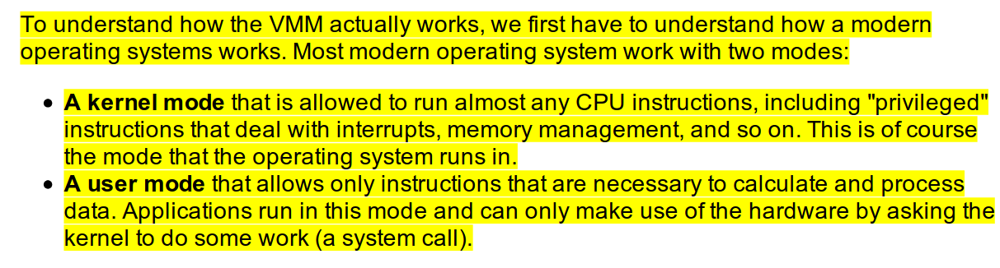
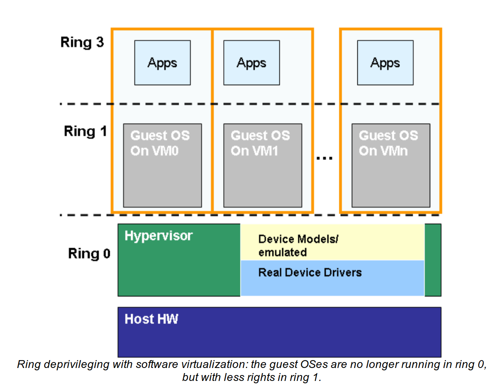
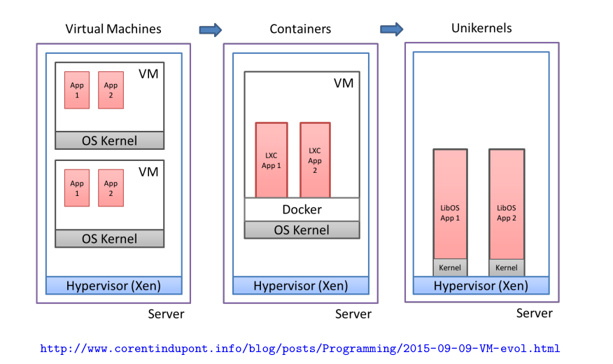
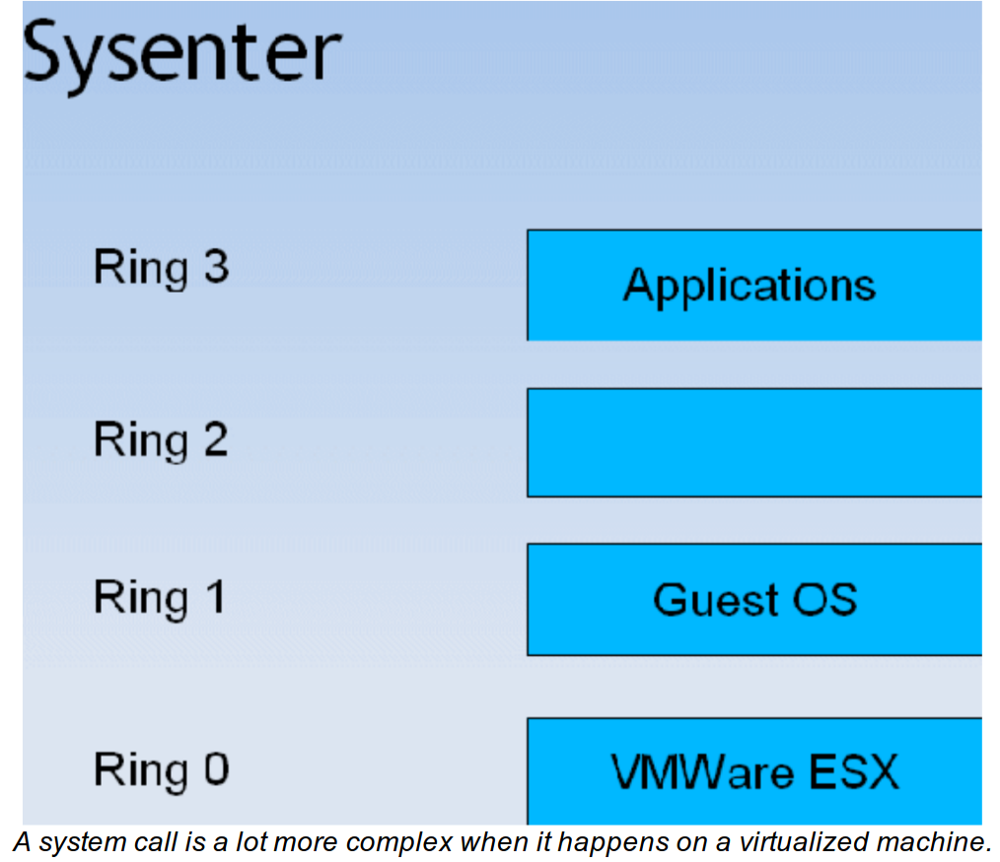
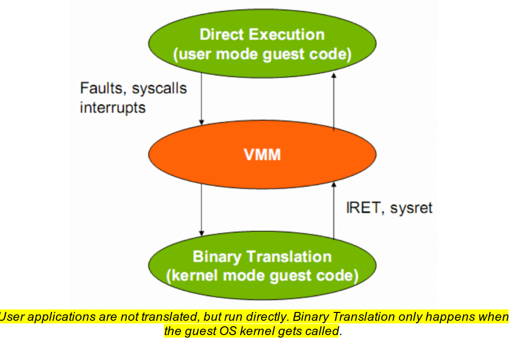
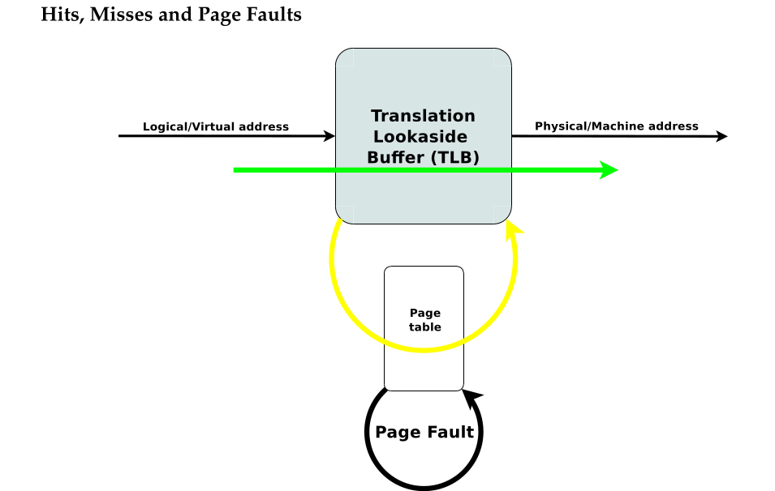
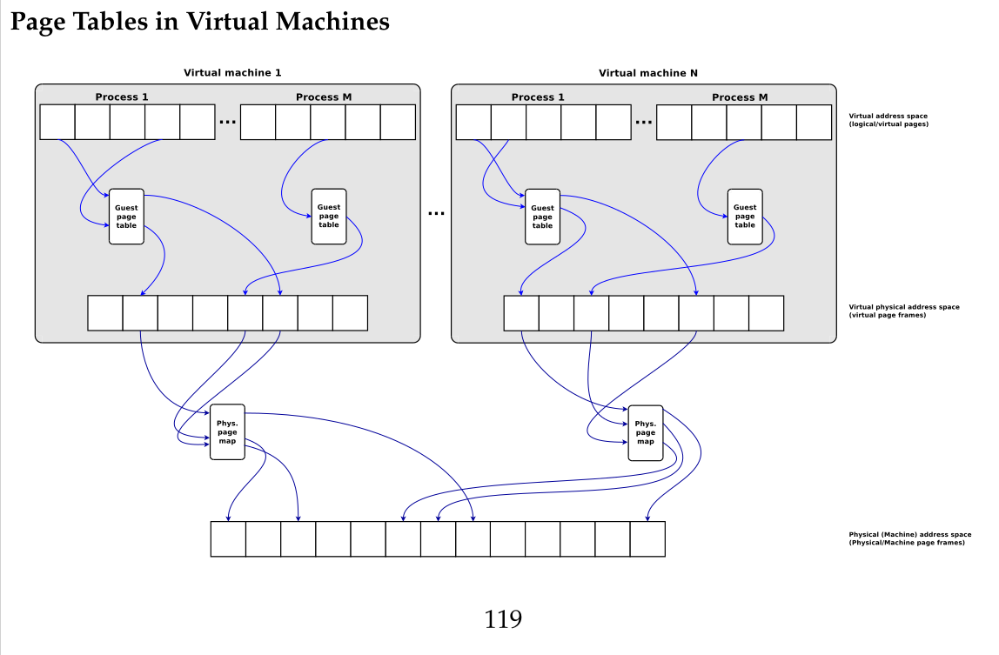
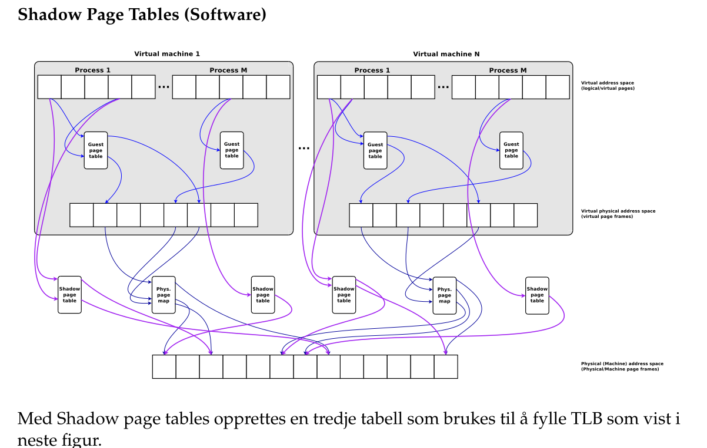
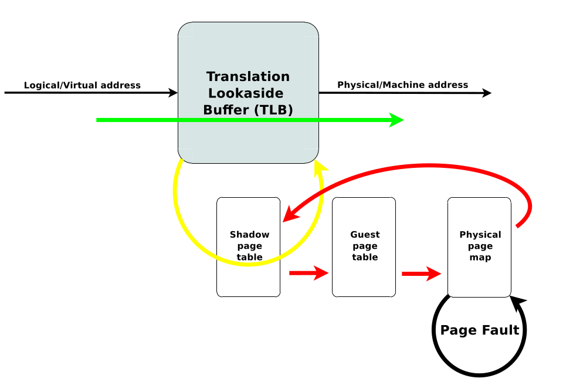
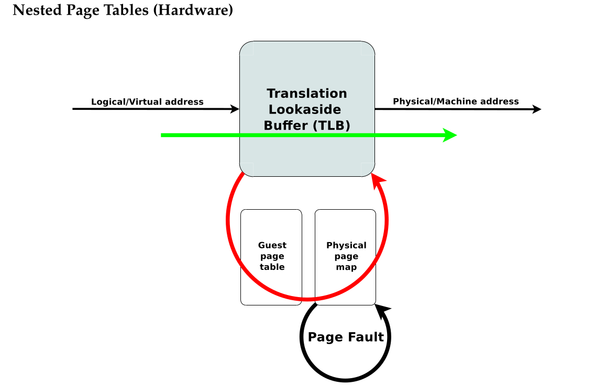

# 11. Virtualisation and Containers

unikernel, sensitive/privileged instructions, trap-and-emulate, binary translation, basic blocks, paravirtualization, hardwaresupported virtualization, vmx/svm/ept/npt/vpid/asid/vt-d, shadow/guest/physical page table, page walk, CR3, cgroup, namespaces, union mounts, Docker

## 11.1 How much OS?

To create several virtual servers, we need a software layer called **the hypervisor or virtual machine monitor (VMM)**. The hypervisor is responsible for managing the virtual servers and their resources. There are two types of hypervisors:

A technique that all (_software based_) virtualisation solutions use is thus a **ring deprivileging**.

**Unikernel** is method for running an application directly on hardware without an operating system.

> Unikernels are typically singel process applications where you compile
> (or more correctly ”statically link”) just the functionality the application needs from
> the operating system into the application binary. A Unikernel application can boot di-
> rectly on hardware (or hypervisor). Unikernel operating systems are sometimes called
> library operating systems, because the application as mentioned chooses the needed
> components (libraries) from the operating system at the time it is being compiled and
> built.

## 11.2 Intro Virtual Machines

> **Virtualisation** means allowing a single computer to host multiple virtual machines.
> 40 years old technology.
> G
> **Binary translation** is a technique used by some hypervisors to run guest code directly on the host CPU. The hypervisor translates the guest code to host code on the fly.

It cannot crack these hard nuts:

- System calls
- Access to chipset and I/O, interrupts and DMA
- Memory management

### Why Virtualisation?

- Servers can run on different virtual machines, thus maintaining the partial failure
  model that a multicomputer.
- It works because most service outages are due to software bugs, not hardware failures.
- Save electricity, cooling, and space.
- Easier to maintain _legacy_ systems.

A kernel is just another process that gets time slices from the multitasking CPU.

> The problem is that a SYSENTER (request the service of the
> kernel) is sent to a page with privilege 0. It expects to find the operating system but it arrives
> in the VMM. So the VMM has to emulate every system call, translate the code, and then
> hand over the control to the translated kernel code which runs in ring 1 [3] .

### 11.2.1 Requirements

**Sensitive instruction** can only be executed in kernel mode.

**Privileged instruction** will trap (generate a interrupt, switch to kernel mode) if executed outside kernel mode.

## 11.4 CPU

> Every systemcall is trapped and handled by the hypervisor (VMM).

### 11.4.1 Binary Translation

During program execution, basic blocks of code are _scanned_ for sensitive instructions.

Sensitive instructions are replaced by a call to vmware procedures.

These translated blocks are cached.

_Very powerful technique, can run at close to native speed because VT hardware
generate many traps (which are expensive)._

### 11.4.2 Paravirtualisation

> In principle the same as binary translation, but you don't translate
> during execution, you change the source code of the operating system beforehand.

Alle sensitive instruksjoner i OSet erstattes med kall til hypervisoren.

Paravirtualisering er en statisk endring av gjesteOSet slik at sensitive instruksjoner endres til kall til hypervisoren.

En fordel med paravirtualisering er at den tillater mye mer endring til gjesteoperativsystemet
enn binæroversetting, derav mulighet for enda mer optimalisering (redusere antall overganger
til VMM), men det går selvfølgelig på bekostning av fleksibilitet, dvs det er ikke alle OS du har
tilgang til kildekoden til...

### 11.4.3 HW Virtualisation

> Introducing another even more privileged level than kernel mode.

## 11.5 Memory

### 115.1 Shadow Page Tables

This is costly because every memory access must be checked against the shadow page table.

Nested page tables:

## 11.6 Containers

Developers can ship their containers with all dependencies "directly" into production.

**Containers are OS-level virtualisation.**

Containere er bare en skjermet samling med prosesser som fortsatt deler operativsystemet med andre containere.

Sikkerhetsmessig betyr det at det en container trenger bare finne en “**kernel exploit**” for å få tilgang til host’en den deler med andre containere (og derav få tilgang til de andre containerne også).

### 11.6.2 Cgroups

Limits use of resources such as CPU, memory, disk I/O, and network.

### Security

**supply chain security** is a big issue with containers: you don't know what you're getting.

# Review Questions and Problems

1. Forklar påstanden til Popek og Goldberg fra 1974: A machine is
   virtualizable only if the sensitive instructions are a subset of the
   privileged instructions.

   - Sensitive instructions are those that can only be executed in kernel mode. Privileged instructions will trap if executed outside kernel mode. The hypervisor must trap and emulate these instructions. So, the hypervisor must be able to trap and emulate all sensitive instructions.

2. VMware does binary translation one basic block at a time, then it
   executes the block and starts translating the next one. Could it
   translate the entire program in advance and then execute it? If so,
   what are the advantages and disadvantages of each technique?

   - Ja, programmet kan oversettes på forhånd. Fordelen med å ikke gjøre det er at
     programmer som regel inneholder mye kode som aldri kjøres. Ved å oversette
     i det programmet kjøres sørges det for at ingen unødvendig kode oversettes.
     Ulempen er eventuell overhead knyttet til å hele tiden starte/stoppe binæroversettingen. Ved å gjøre dette på forhånd kan hele programmet istedet oversettes
     sammenhengende, men denne fordelen er nok liten i forhold til all unødvendig
     kode som da oversettes.

3. Forklar hvordan datamaskinarkitekturens beskyttelsesringer (protection rings) benyttes ved virtualisering når virtualiseringsteknikken er binæroversetting (VMware’s teknologi).

   - VMM i ring 0, gjesteOS i ring 1 og gjesteapplikasjoner i ring 3.

4. Hva karakteriserer en applikasjon som vil være utfordrende/problematisk å kjøre på en virtuell maskin?.
   - Dependant on I/O, memory-intensive, or requires many syscalls
5. Forklar kort fordeler og ulemper med shadow page tables i forhold til nested/extended page tables.

   - With shadow page tables, today's MMUs can be used and also TLB can be used to cache, but it is hard to keep the shadow page table, guest page table, and physical page table synchronized.

   - Med NPT/EPT er hardware klar over at det finnes to typer pagetabeller og kan gjøre kjapp 2D page walk, så man slipper overhead’n ved å vedlikeholde synkroniseringen med de tre page tabellene, men på bekostning av en noe mer kostbar oppslagsmetode ved TLB miss.

6. Hvordan forbedrer Docker-containere samarbeidet mellom utvikling og drift?

   - Utviklere kan pakke alle avhengigheter sammen med applikasjonen og levere den til produksjon.

7. Hva er Linux cgroups? Hva er hensikten med cgroups?
   - Cgroups er en Linux kernel feature som lar deg gruppere prosesser og sette begrensninger på ressursbruk som CPU, minne, disk I/O og nettverk.
8. Hva gjør du hvis tjenesten du kjører i en container er avhengig av å
   lagre data lokalt på disk?
   - Bruk en volume.
