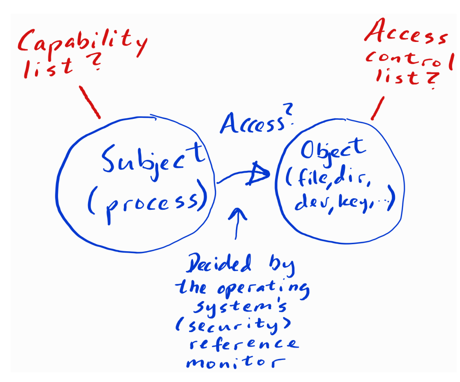
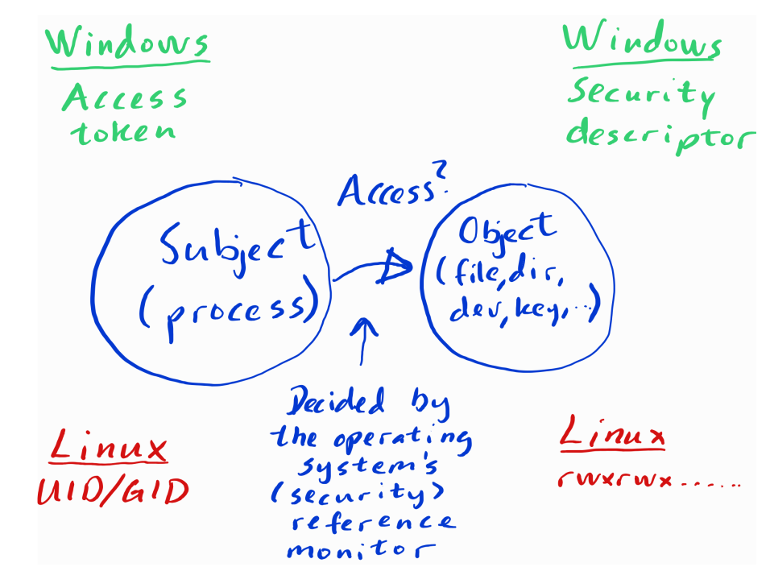
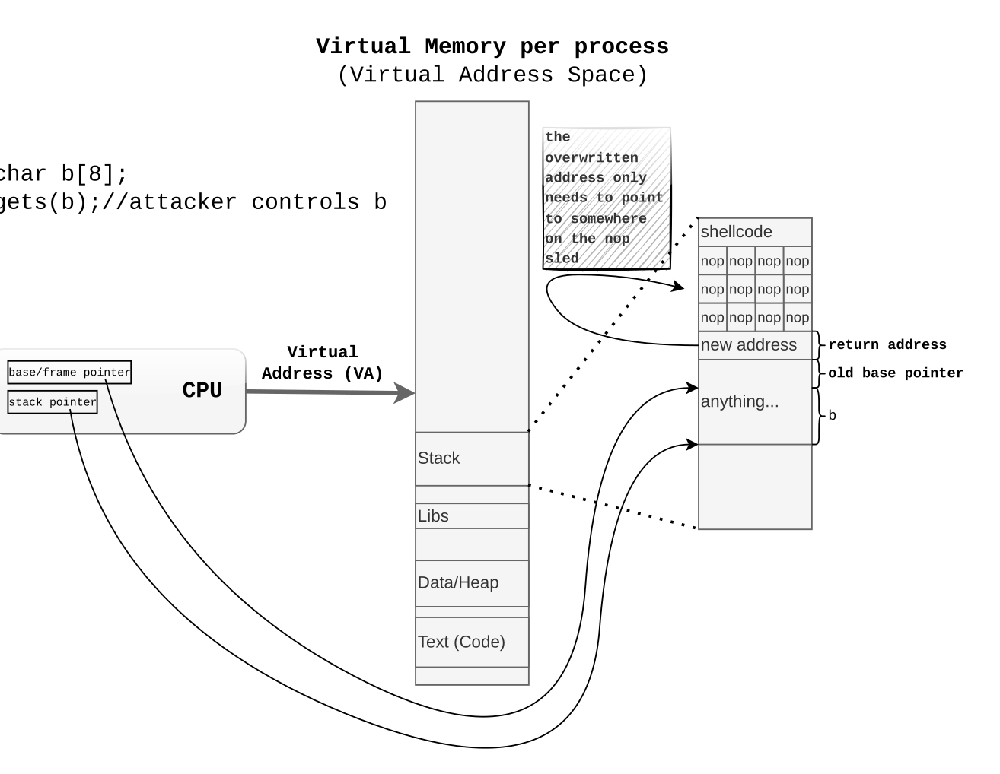

# 12. Security

security policy, CIA, secure systems design principles, reference monitor, identification, authentication, authorization, capability, ACL, ACE, access token, security descriptor, privileges, MAC, DAC, mandatory integrity control, DACL, SACL, integrity levels, SID, secure attention sequence, UAC, namespace virtualization, UID/GID, sudo, buffer overflow, heap spraying, nop sled, stack canary, DEP, NX, return-to-libc, ASLR

## 12.1 Introduction

- The OS itself needs to be secure

  - If the OS is not secure, all the applications running on it are also not secure

- The OS enforces security policies (access control, etc.)

- The OS should **_limit/prevent_** damage from vulnerable software

OS's are hard to secure because: Big, Complex, and Evolving

### 12.1.1 Security Goals

**Goals of Security:**

- **Confidentiality:** Prevent unauthorized access to data
- **Integrity:** Prevent unauthorized modification of data
- **Availability:** Ensure that data is available when needed

### 12.1.2 Design Principles

1. **Economy of Mechanism**: Keep the design as simple as possible
2. **Fail-safe defaults**: Deny access by defaulta
3. **Complete mediation**: Every access must be checked in accordance with the security policy
4. **Open design**: The security mechanisms should not be secret -
5. **Separation of privilege**: Multiple conditions must be met to access a resource
6. **Least privilege**: A user should have the least amount of privilege to do their job
7. **Least common mechanism**: Minimize the amount of mechanisms shared between users
8. **Acceptability**: The security mechanisms should not be so cumbersome that they are not used

## 12.2 Access Control

### 12.1.1 Reference Monitor

The OS has a reference monitor that mediates all accesses to objects (files, devices, etc.)

- Identification, authentication, authorization

The OS can achieve this in two ways:

### 12.2.2 Capability/ACL



1. **Access Control List (ACL)**: A list of permissions attached to an object
2. **Capabilities** : A list of permissions attached to a user



- Windows uses Access Tokens and Security Descriptors
- Linux uses UID/GID and Read/Write/Execute permissions

> Entries (ACEs) in an ACL are scanned in order. Any DENY entries are always present
> before ALLOW entries, and the scanning of the list ends as soon as a DENY entry
> matches. If this is not the case, the ALLOW entries are scanned in order until one has
> found an ALLOW entry that matches.

> The concept of capabilities exists in different implementations. In Windows, we have
> Privileges (but note that this is NOT what the literature typically refers to as a ”capa-
> bility list”, think of the windows privileges as ”capabilities grouped into task permis-
> sions”)

## 12.2.3 MAC/DAC

Mandatory Access Control (MAC) and Discretionary Access Control (DAC)

**MAC**: The system decides access control - is when the OS enforces some rules that override DAC. An example of this is Mandatory Integrity Control on Windows. Sometimes this is referred to just as Windows Integrity Levels. In an object’s security
descriptor on Windows there is a System Access Control List (SACL) where an integrity
level is stored, and a Discretionary Access Control List (DACL) where the access control
list mentioned earlier is stored.

**DAC**: The user decides access control: Example `chmod` in Linux

**_Mandatory Integrity Control (MIC)_**

- Processes have integrity levels (low, medium, high) in their access tokens
- Objects have integrity levels in their security descriptors (SACL)
- **_• The Security Reference Monitor (SRM), before going to DACL, checks SACL and allows
  a process to write or delete an object only if its integrity level is greater than or equal to
  that of the object_**
- Processes cannot read process objects with higher integrity levels

**Content of a Windows Security Descriptor**

- **Owner SID**: The SID of the owner of the object (SID = Security Identifier)
- **Group SID**: The SID of the group of the object
- **DACL**: Discretionary Access Control List
- **SACL**: System Access Control List (what should be logged and the integrity level)

## 12.3 Memory Protection

### 12.3.1 Buffer Overflow

**buffer overflow**: When a program writes more data to a buffer than it can hold

This can be abused to overwrite the return address of a function, and make it return to a different function.



**NX-bit**: Non-Executable bit, prevents code from being executed from the stack

Defense against `return-to-libc` attacks:

Address Space Layout Randomization (ASLR): Randomizes the location of the stack and heap

## Review Questions and Problems

1. Explain briefly with examples two of Saltzer and Schroeders design
   principles.
   - Economy of mechanism: Keep the system as simple as possible. This makes it easier to secure.
   - Fail-safe defaults: Deny access by default. This makes it harder to accidentally expose data.
2. Briefly explain the difference between file permissions in Linux and access control lists for files in Windows.
   - On Linux there is three ACE in ACL for owner, group and others. On Windows there is a flexible ACL.
3. Briefly explain buffer overflow and return-to-libc attacks.

   - Buffer overflow: When a program writes more bytes that exceeds the buffer size and rewrites the return address of a malicious function.
   - Return-to-libc: Instead of returning to a malicious function, it returns to a libc function, such as `system()`..

4. On a Windows server, jens has a directory/folder prosjekter that should have
   the following access rules:

   - jens and jonas should have full access

   - Everyone in the group ap except for karita should have read access

   - kristin and liv should have read access

   -> Jens: Full access, Read access; Jonas: Full access; Karita (DENY)Read Access; Liv: ReadAccess; Kristin: ReadAccess; ap: ReadAccess

5. Consider the following session in Bash command line:

   - `$ ls -l mypw
---------- 1 root root 129824 mai 11 10:16 mypw
$ XXXXXXXXXXXXXX    - No, Linux bases access control in terms of the owner, while Windows the does. (First entry in ACE is owner)X
$ ls -l mypw
-rwsr-xr-x 1 root root 129824 mai 11 10:16 mypw
Which command (with options) is hidden behind 'XXXXXXXXXXXXXXX'?
Justify your answer.`

   - `chmod 4755 mypw` - sets the setuid bit on the file, which makes it run as the owner of the file, in this case root.
   - No, Linux bases access control in terms of the owner, while Windows the does. (First entry in ACE is owner)

6. (KEY PROBLEM) Is the owner of a file used in access control in
   the same way in both Linux and Windows? Justify your answer.

   - No, Linux bases access control in terms of the owner, while Windows the does. (First entry in ACE is owner)

7. (KEY PROBLEM) What is the problem with the following C-code?
   Explain in as much detail as you can exactly WHEN you get an error
   message when you try to run this the program. Suggest a solution to
   make the program secure.

```c
#include <stdio.h>
#include <stdlib.h>
#include <string.h>

int main(int argc, char \*\*argv) {
    char buff[5];
    if (argc != 2) {
        printf("Need an argument!\n");
        exit(1);
    }
    strlcpy(buff, argv[1], sizeof(buff));
    printf("\nYou typed [%s]\n\n", buff);
    return (0);
}
```

-- add safe version of strcpy, such as `strlcpy` or `strncpy`

8. Make sure you have completed the Return-to-libc lab tutorial. What
   is the purpose of these command lines?

```sh
gcc -fno-stack-protector -z noexecstack -o retlib retlib.c
sudo chown root retlib
sudo chmod 4755 retlib
export MYSHELL=/bin/sh
```

- first line: compile the program without stack protection and with a non-executable stack
- second line: change the owner of the program to root
- third line: set the setuid bit on the program
- fourth line: export the path to the shell to be used in the program

<script type="text/javascript" src="http://cdn.mathjax.org/mathjax/latest/MathJax.js?config=TeX-AMS-MML_HTMLorMML"></script>
<script type="text/x-mathjax-config">
    MathJax.Hub.Config({ tex2jax: {inlineMath: [['$', '$']]}, messageStyle: "none" });
</script>
