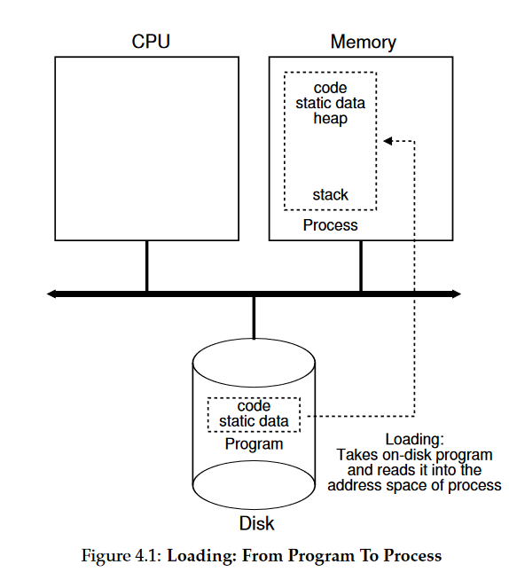
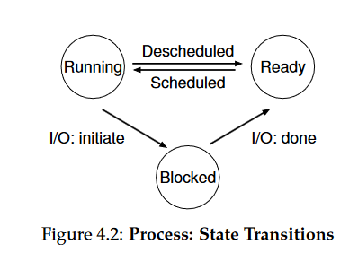
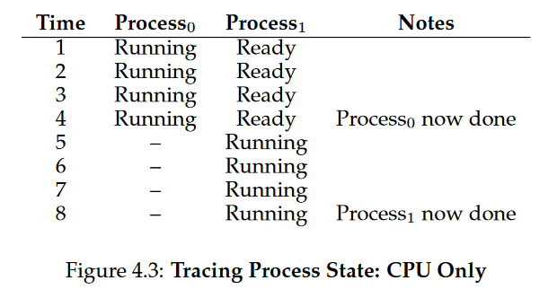
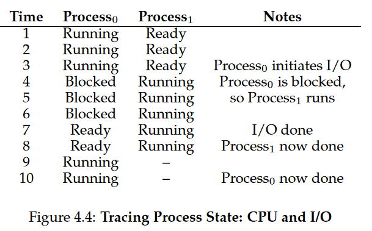
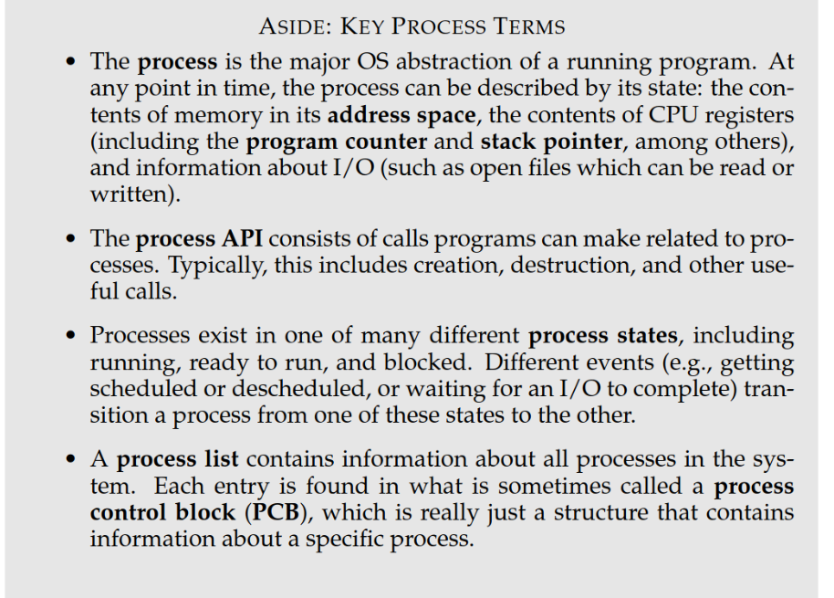

# 2. Operating System

Process, process API, thread/multi-threaded, process states (ready/running/blocked), PCB, process list/table, address space, file, design goals, time-sharing, batch, soft/hard real-time, service/user process, CPU/IO/Memory-bound processes, GNU, POSIX, bit/Byte, KB/MB/GB/TB/PB/EB, ms/us/ns, gcc

## 2.1 Introduction

The OS virtualises physical resources (i.e. make it accessible) so they become user friendly and easy
to use.

The OS is a **resource manager** that manages the hardware resources (CPU, memory and disk) of the computer.
The OS exports a few hundred **system calls** to allow users to interact with the OS.

_In short_: it takes physical resources, such as a CPU, memory, or disk, and virtualises them. It handles tough and tricky issues related to concurrency. And it stores files persistently, thus making them safe over the long-term

### 2.1.1 Virtualise memory

Here the CPU is virtualised so that each process thinks it has the entire memory to itself.

```c
#include <unistd.h> #include <stdio.h>
#include <stdlib.h>
#include "common.h"

int
main(int argc, char *argv[])
{
 int *p = malloc(sizeof(int)); // a1
 assert(p != NULL);
 printf("(%d) address pointed to by p: %p\n",
 getpid(), p); // a2
 *p = 0; // a3
 while (1) {
  Spin(1);
  *p = *p + 1;
  printf("(%d) p: %d\n", getpid(), *p); // a4
 }
 return 0;
}
```

### 2.1.2 Concurrency

**Thread**: "a function running withing the same memory address as other functions
with more than one of them alive at a time."

## 2.2 Design Goals

OS design goals
_Virtualisation_ create abstractions
_Performance_ minimize overhead
_Security_ protect/isolate applications (not harm each other)
_Reliability_ stability (run non-stop)
_Energy-efficient_ environmentally friendly

## 2.3 History

**Batch processing** - jobs run in sequence by the operator

_System calls_ invented by Atlas computing systems.

**Multiprogramming** - multiple jobs run in parallel (rapidly switch between jobs)

Before 1970

- 1940-55 Direct machine code, moving wires
- 1955-65 Simple OS’s, punchcards
- 1965-70 Multics, IBM OS/360 (the mainframe)

Unix/Linux

- Ken Thompson developed a stripped-down version of MULTICS on a PDP-7 he
  got hold of in 1969
- A large number of flavors developed (SystemV or Berkely-based)
- The GNU-project started in 1983 by Richard Stallman
- Unified with POSIX interface specification in 1985
- Minix in 1987 inspired Linus Torvalds to develop Linux (released in 1991)

CHAPTER 2. OPERATING SYSTEMS AND PROCESSES
2.3.2 Windows
Windows
• IBM sold PCs bundled with MS-DOS from beginning of 80s
• DOS/Windows from 85-95
• Win95/98/Me from 95-2000
• WinNT, 2000, XP, Vista, 7, 8, 10 from 93-
• WinNT, 2000, 2003, 2008, 2012, 2016, 2019 from 93-

## 2.4 Process

The OS creates this illusion by _*virtualising*_ the CPU. By running one
process, then stopping it and running another, and so forth, the OS can
promote the illusion that many virtual CPUs exist when in fact there is
only one physical CPU

This technique is called _*time-sharing*_ of the CPU (generally sharing of a
resource); allowing users to run as
many concurrent processes they'd like: hence the cost is performance

Counterpart is _*space sharing*_ where the OS divides a resource into pieces
(e.g. disk)

_*Mechanism*_ is the means by which the OS provides a service (low-level
machinery).

_*Policies*_ are algorithms for making some kind of decision within the OS. For
example: given a number of possible programs to run, which one should be run next? -> a _*scheduling policy*_ will make this decision.

_*Process*_ is an instance of a running program. It consists of the program code, data, and stack. It is the unit of work in a system. It is the unit of scheduling and dispatching.

### 2.4.1 Process API

- _*Create*_: An OS must include some method to create/invoke a new process.
- _*Destroy*_: An OS must include some method to destroy a process.
- _*Wait*_: An OS must include some method to wait for a process to finish.
- _*Miscellaneous*_: An OS must include other methods to manage processes.
- _*Status*_: An OS must include some method to get the status of a process.



### 2.4.2 Process Creation

_see picture above_

1. The first thing the OS does is load (as an `.exe`) its code and any static data (e.g. initialized global variables) into memory, specifically into the address space.

> Old OS's would load the entire program into memory, but modern OS's use _*demand paging*_ to load only the parts of the program that are actually used (_eagerly vs. Lazily loading_).

2. After that, some memory is allocated for the program's _*stack*_ and _*heap*_.
3. The Os will do some other initialization tasks, particularly as related to
   I/O. (each process has its own _*file descriptor table*_)
4. Execute the program (i.e. the `main()` function).

### 2.4.3 Process States

There are three (primarily) states a process can be in:



- _*Running*_: The process is running on the CPU (executing instructions).
- _*Ready*_: The process is waiting to run.
- _*Blocked*_: The process is waiting for some event to occur (e.g. I/O).

Moving from ready to running means the process has been _*scheduled*_. Running
to ready, the process has been _*descheduled*_.

Without I/O:


With CPU and I/O:



A **process list** contains information about all processes in the sys-
tem. Each entry is found in what is sometimes called a _process
control block (PCB)_, which is really just a structure that contains
information about a specific process.

### 2.4.4 Data Structures

To track the state of each process, the OS will keep some kind of _*process
list*_ for all processes that are ready and some additional information to track
which is running.

The _*register context*_ will hold, for a stopped process, the contents of its
registers; saved into its memory location; then by placing the contents of the
registers back into the registers, the process can be restarted (_*context
switch*_)

## Summary


# 2.5 Review questions and problems

1. What are the two main tasks of the OS?

   > Virtualise (takes in a physical resource and transfroms into a more general, easy to use virtual form of itself)
   > Manage system resources and processes

2. What are the design goals for the OS?
   > Virtualisation, reliability (stability). energy-effecting, security and performance
3. What is "batch processing"?

   > Jobs run in sequence by the operator (no user interaction)

4. What information is in process list /table?

   > Contains information about all process in the system. Each entry is found
   > process control block (PCB) which contains information about a specific process

## Summary


