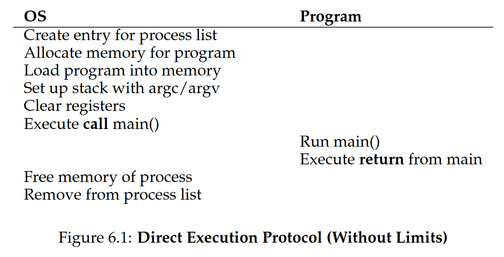
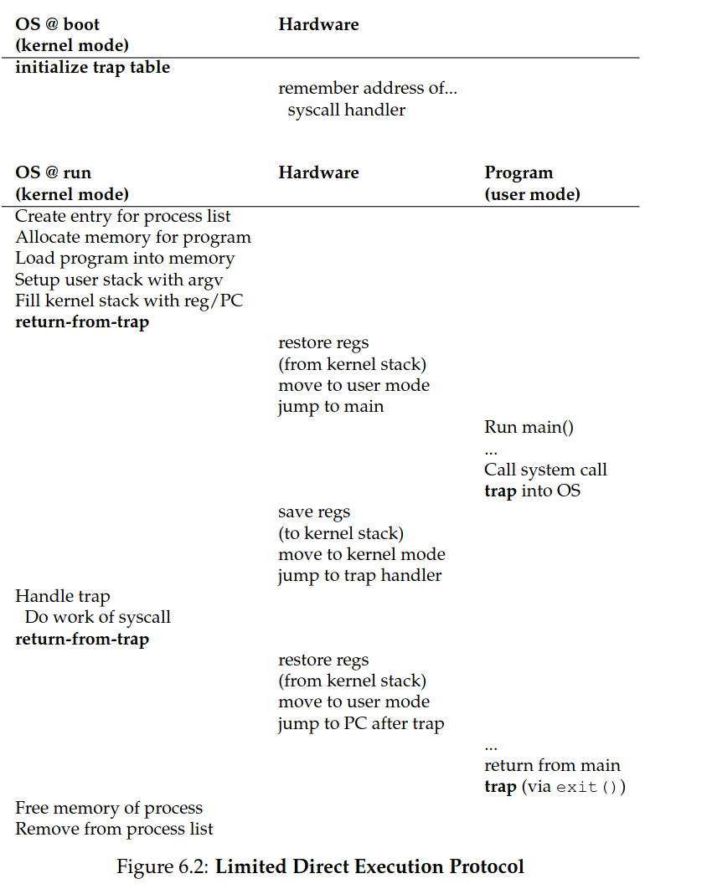
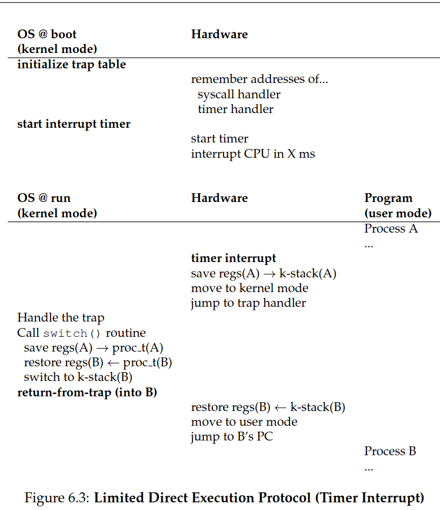

# 3. System Calls

fork, copy-on-write, exec, wait, signal, limited direct execution, instructions/system calls/commands, kernel mode, user mode, mode switch/transition, preemptive multitasking, trap table (interrupt vector table), sync/async interrupts, software/exception/hardware interrupt, timer interrupt, Process ID (PID), (call) stack, kernel stack, privileged operation/instruction, cooperative vs preemptive (timer interrupt)

## 3.1 System Calls

Using `fork()`and `exec()` system calls to create a new process and run a program in it. The `wait()` system call is used to wait for the child process to complete.

### 3.1.1 fork()

> Creates a new process

```c
#include <stdio.h>
#include <stdlib.h>
#include <unistd.h>

int main(int argc, char *argv[]) {
  printf("hello (pid:%d)\n", (int) getpid());
  int rc = fork();

  if (rc < 0) {
    // fork failed
    fprintf(stderr, "fork failed\n");
    exit(1);
  } else if (rc == 0) {
    // child (new process)
    printf("child (pid:%d)\n", (int) getpid());
  } else {
    // parent goes down this path (main)
    printf("parent of %d (pid:%d)\n",
    rc, (int) getpid());
  }
  return 0;
 }
```

```
prompt> ./p1
hello (pid:29146)
parent of 29147 (pid:29146)
child (pid:29147)
prompt>
```

Note that the parent receives the child's process ID from the `fork()` system call. The child receives `0` from the `fork()` system call, hence printing "child...". One can then use this to write code that is executed by the child process.

`fork()` uses **copy-on-write** to avoid allocating memory unnecessarily. Copy-on-write
means that the new process can just keep using the memory of the parent process as
long as both processes just issues reads. As soon as one of them issues a write, then the
two processes need their own private copy.

### 3.1.2 wait()

> Waits for the child process to complete and execute remaining code of the parent process

```c
#include <stdio.h>
#include <stdlib.h>
#include <unistd.h>
#include <sys/wait.h>

int main(int argc, char *argv[]) {
  printf("hello (pid:%d)\n", (int) getpid());
  int rc = fork();

  if (rc < 0) { // fork failed; exit
    fprintf(stderr, "fork failed\n");
    exit(1);
  } else if (rc == 0) { // child (new process)
    printf("child (pid:%d)\n", (int) getpid());
  } else { // parent goes down this path
    int rc_wait = wait(NULL);
    printf("parent of %d (rc_wait:%d) (pid:%d)\n",
    rc, rc_wait, (int) getpid());
  }
  return 0;
}
```

`prompt> ./p2
hello (pid:29266)
child (pid:29267)
parent of 29267 (rc_wait:29267) (pid:29266)
prompt>`

That way we can always ensure that the parent process waits for the child process to complete.

### 3.1.3 exec()

> Replaces the current process with a new program

```c
#include <stdio.h>
#include <stdlib.h>
#include <unistd.h>
#include <string.h>
#include <sys/wait.h>

int main(int argc, char *argv[]) {
  printf("hello (pid:%d)\n", (int) getpid());
  int rc = fork();

  if (rc < 0) { // fork failed; exit
    fprintf(stderr, "fork failed\n");
    exit(1);
  } else if (rc == 0) { // child (new process)
    printf("child (pid:%d)\n", (int) getpid());
    char *myargs[3];
    myargs[0] = strdup("wc"); // program: "wc"
    myargs[1] = strdup("p3.c"); // arg: input file
    myargs[2] = NULL; // mark end of array
    execvp(myargs[0], myargs); // runs word count
    printf("this shouldn’t print out");
  } else { // parent goes down this path
    int rc_wait = wait(NULL);
    printf("parent of %d (rc_wait:%d) (pid:%d)\n",
    rc, rc_wait, (int) getpid());
  }
  return 0;
}
```

`prompt> ./p3
hello (pid:29383)
child (pid:29384)
29 107 1030 p3.c
parent of 29384 (rc_wait:29384) (pid:29383)
prompt>`

Here, it **loads** code (and static data) from the given executable (`wc`)
and **overwrites** the current code segment (and current static data) with
it; essentially re-initializing the process with the new program.

### 3.1.4 Why fork-exec?

The `fork()/exec()` combination is a powerful way to create
and manipulate processes

### 3.1.5 Process Control and Users

The `kill()` system call is used to send **signals** to a process (e.g.,
pause, die, etc.)

**users** can generally only control their own processes

--

## 3.2 Process Execution

**time-sharing** created performance issues. The second is _control_: how can we ensure that one process doesn’t interfere with another?

### 3.2.1 Limited Direct Execution

To make a program run as fast as possible, **limited direct execution** is used. This means that the CPU runs the program’s instructions directly, without any intervention from the operating system.



This approach (which is not _limited_) raises a few problems:

- **security**: a user program could issue a privileged operation
- **control**: how can we ensure that one process doesn’t interfere with another?

**Trap instructions** are what's really "inside" a system call.

We introduce the concept of **kernel mode** and **user mode**:

- **user mode**: code that runs in user mode is restricted; e.g. the process
  cannot issue I/O requests: doing so would raise an exception and the OS would
  kill it.
- **kernel mode**: code that runs in kernel mode can do anything it wants.

But how can a process on user mode perform privileged operations?

- by using **system calls**

1. The program must execute a special **trap** instruction to switch to kernel mode.
2. When finished, the OS calls a **return-from-trap** instruction to switch back to user mode.

The hardware needs to be a bit careful; hence pushes the program counter, flags
and other registers onto the **kernel stack**; then the "return-from-trap"
instruction" will pop these values off the stack and restore the user process.

How does the calling process know which code to run inside the OS?

-> The kernel does so by using a **trap table** (also known as an interrupt vector table).

- When booting up, the kernel tells the hardware what code to run when certain exceptional events occur.
- That way the hardware knows the locations of these **trap handlers** with
  special instructions.



To specify exact system call, a **system call number** is used, such that the OS
can verify if it's valid or not (a form of _protection_).

### 3.2.2 Switching Between Processes

When an application is, e.g., divides by zero, or tries to access undefined
memory, it will **generate an trap** to the OS; then the OS will have control
and will likely kill the offending process.

That is the **passive approach** to switching between processes.

However, what if the process are not cooperating?
-> By using **timer interrupts**.

> The timer device is programmed to raise an interrupt every ms and a
> pre-configured interrupt handler in the OS is ran. Thus the OS has regained
> control.

In addition to creating trap table entries for system calls, the OS also
**starts a timer** which is a privileged operation. Then it is safe for the OS
to take control eventually (periodically) and switch to another process.

#### Context Switch

If the decision is made to switch to another process (made by the
**scheduler**), then the OS executes low-level code to perform a **context switch**.

1. The OS saves the current process's registers and memory mappings.
2. The OS loads the new process's registers and memory mappings.
3. The OS runs the new process.

To save the context of the currently-running program, the OS will execute
assembly code to save the general purpose registers, PC, and the kernel stack
pointer and then restore said registers, PC and stack pointer for the new process.


