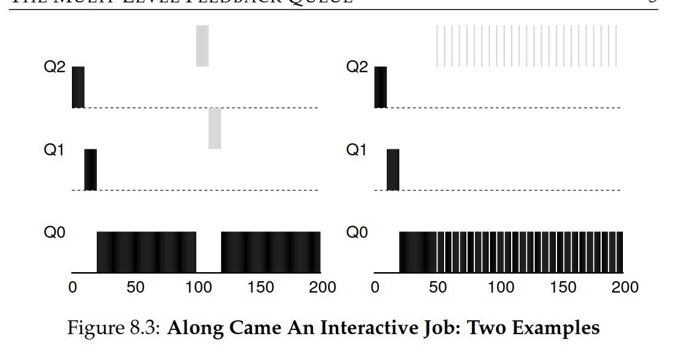

# 4. Scheduling

clock interrupt, preemptive vs non-preemptive, turnaround time, response time, workload, FCFS/FIFO, convoy effect, SJF, STCF, Round Robin, time quantum, jiffie, MLFQ, priority levels, boost, dynamic priority, fair-share/lottery scheduling, CPU-pinning/affinity, gang-/co-scheduling

## 4.1 Turnaround Time

> The time from the arrival of a process to the completion of that process.

**Assumptions (we have to break) Workload assumptions:**

- _Each job runs for the same amount of time:_ This assumes that all processes have equal execution times, making it easier to design and analyze scheduling policies.

- _All jobs arrive at the same time_: This simplifies the problem by assuming there is no need to manage different arrival times, which is often a complicating factor in real-world scheduling. _Once started, each job runs to completion:_ This assumption ignores preemption (where a job can be interrupted and resumed later) and allows for simpler continuous execution models.

- _All jobs only use the CPU (i.e., they perform no I/O)_: This eliminates the complexity of handling jobs that may need to wait for input/output operations, focusing purely on CPU-bound tasks.

- _The run-time of each job is known_: This assumes full knowledge of how long each job will take to execute, which simplifies the scheduling decisions but is unrealistic since job durations are not always predictable in practice.

**Turnaround time (a performance metric) which is:**
$$T_{Turnaround} = T_{completion} - T_{arrival}$$

### 4.1.1 FIFO

Why FIFO is not great, (Processes with shorter burst times are delayed by processes with longer burst times):

### 4.1.2 SJF (Shortest Job First)

SJF solves this problem by selecting the process with the shortest burst time next. This minimizes the average waiting time for all processes.

Problem with SJF:

### 4.1.3 SRTF (Shortest Remaining Time First)

Here SRTF is a preemptive version of SJF, where the currently running process is preempted if a new process with a shorter burst time arrives. This ensures that the process with the shortest remaining time is always running.
_preemptive vs non-preemptive_

Average turnaround time is then:
$$\frac{(120-0) + (20-10) + (30-10)}{3} = 50 seconds$$

While great for turnaround time, this approach is quite bad for response time and
interactivity

## 4.2 Response Time

> The time from a process enters the system until it runs for the first time

$$T_{Response} = T_{first-run} - T_{arrival}$$

### 4.2.1 Round Robin

> Each process gets a small unit of CPU time (time quantum), usually 10-100 milliseconds. After this time has elapsed, the process is preempted and added to the end of the ready queue.

Response time:
$$\frac{(0+1+2)}{3} = 1 second$$

But Round Robin is not great for turnaround time: (Processes with shorter burst times are delayed by processes with longer burst times)
So turnaround time is:

$$\frac{(13+14+15)}{3} = 14 seconds$$

### 4.2.2 Overlap

> Treat each CPU-burst as a separate job.

## 4.3 MLFQ (Multi-Level Feedback Queue)

### 4.3.1 Basics

_Two basic rules:_

- Rule 1: If Priority(A) > Priority(B), A runs (B doesn’t).
- Rule 2: If Priority(A) = Priority(B), A & B run in RR.

Key point: **MLFQ varies the priority of a process based on its behavior.**

Example:

If, for example, a job
repeatedly relinquishes the CPU while waiting for input from the key-
board, MLFQ will keep its priority high, as this is how an interactive
process might behave. If, instead, a job uses the CPU intensively for long
periods of time, MLFQ will reduce its priority. In this way, MLFQ will try
to learn about processes as they run, and thus use the history of the job to
predict its future behavior

**allotmenet** - is the amount of time a job can spend at a given priority level before the scheduler reduces its priority

**_Priority_**:

- Rule 3: When a job enters the system, it is placed at the highest
  priority (the topmost queue).
- Rule 4a: If a job uses up its allotment while running, its priority is
  reduced (i.e., it moves down one queue).
- Rule 4b: If a job gives up the CPU (for example, by performing
  an I/O operation) before the allotment is up, it stays at the same
  priority level (i.e., its allotment is reset).

In right, B is requesting I/O

Problem with current MLFQ:

- Starvation: A job may never get to run (especially lower priority jobs)
- Security issues
- A program may change its behavior, thus not being treated correctly

### 4.3.2 Priority Boosting

Rule 4 is rewritten as:

- Rule 4: Once a job uses up its time allotment at a given level (regardless of how many times it has given up the CPU), its priority is
  reduced (i.e., it moves down one queue).
- Rule 5: After some time period S, move all the jobs in the system
  to the topmost queue.

---

One issue is how to **parameterize** the scheduler. For example, how do we set the time quantum for Round Robin? How do we set the time period S for MLFQ? How do we set the priority boost? These are all parameters that can be set by the system administrator, but how do we choose good values for these parameters?

### 4.5 Fair Share Scheduling

Lotter: Each job gets a number of lottery tickets. When a scheduling decision needs to be made, a lottery ticket is drawn, and the job holding that ticket runs.

### 4.6 Multiprocessor

Multiprocessor Architecture: Single-CPU systems use caches to speed up data access. In multiprocessor systems, sharing data between CPUs complicates caching due to issues like cache coherence, which hardware solves through techniques like bus snooping.

Cache Affinity: Processes perform better when run on the same CPU repeatedly because cached data remains. Multiprocessor schedulers should consider this to improve efficiency.

## Reviews Questions and Problems

1. What do we mean with starvation with respect to the Shortest Job
   First scheduling algorithm?
   > When other higher priority jobs keep on coming leaving lower priority jobs to wait indefinitely
2. Homework simulations:

- Compute the response time and turnaround time when running
  three jobs of length 200 with the SJF and FIFO schedulers.

  FIFO:

  Turnaround: (200+400+600)/3 = 400
  Response: (0+200+400)/3 = 200

  SJF:
  same result becuase all jobs are of same length

- Now do the same but with jobs of different lengths: 100, 200, and 300.

  FIFO:

  Turnaround time: (100+300+600)/3 = 333
  Response time: (0+100+300)/3 = 133

  SJF:

  Turnaround time: (100+300+600)/3 = 333
  Response time: (0+100+300)/3 = 133

- RR with time quantum of 1 second
  Turnaround time: (300+500+600)/3 = 466
  Response time: (0+1+2)/3 = 1
