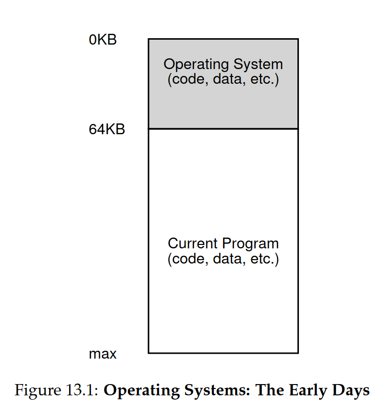
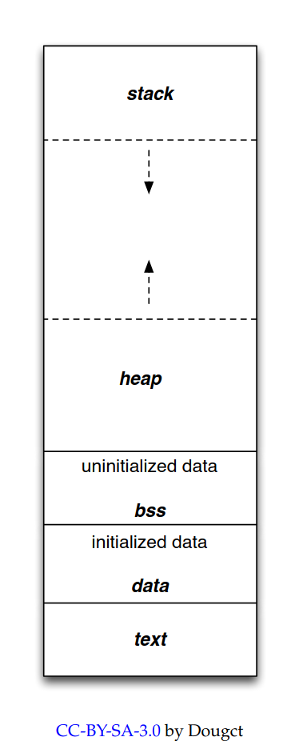
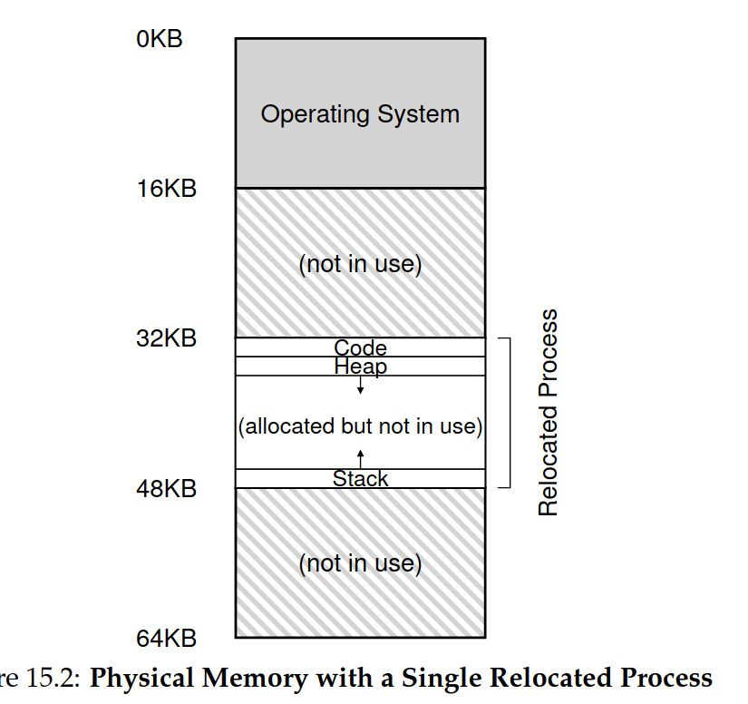
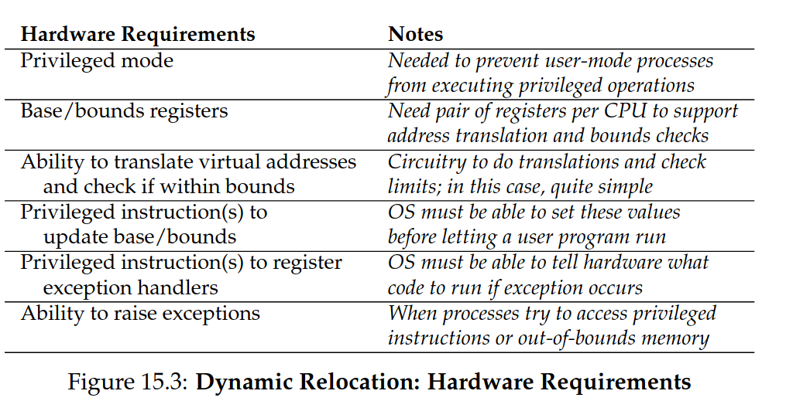
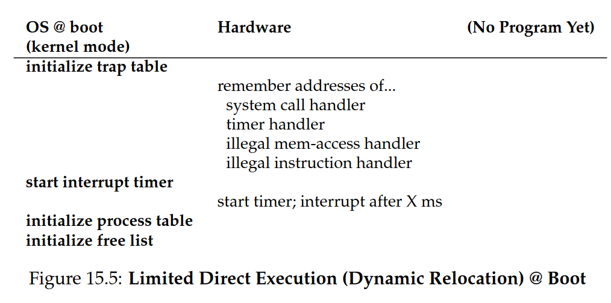
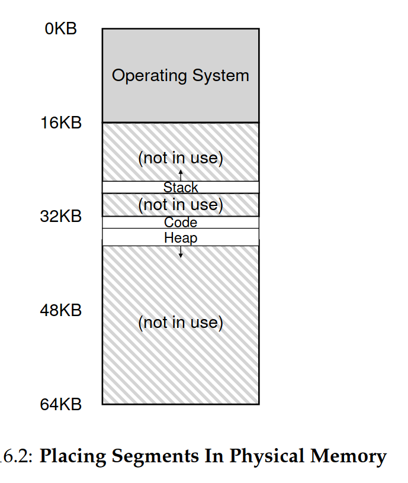
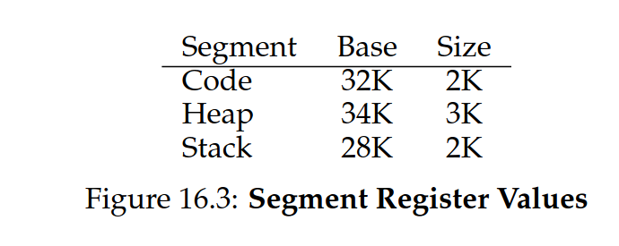
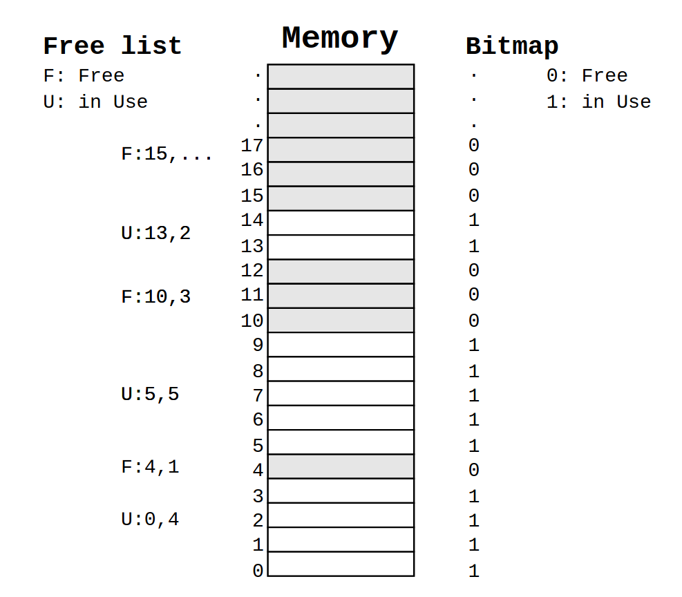
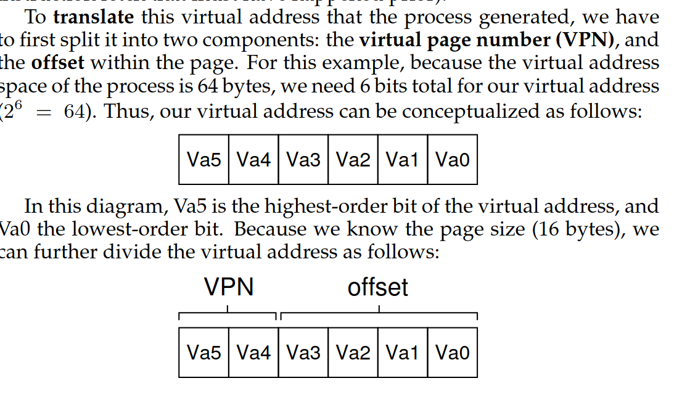
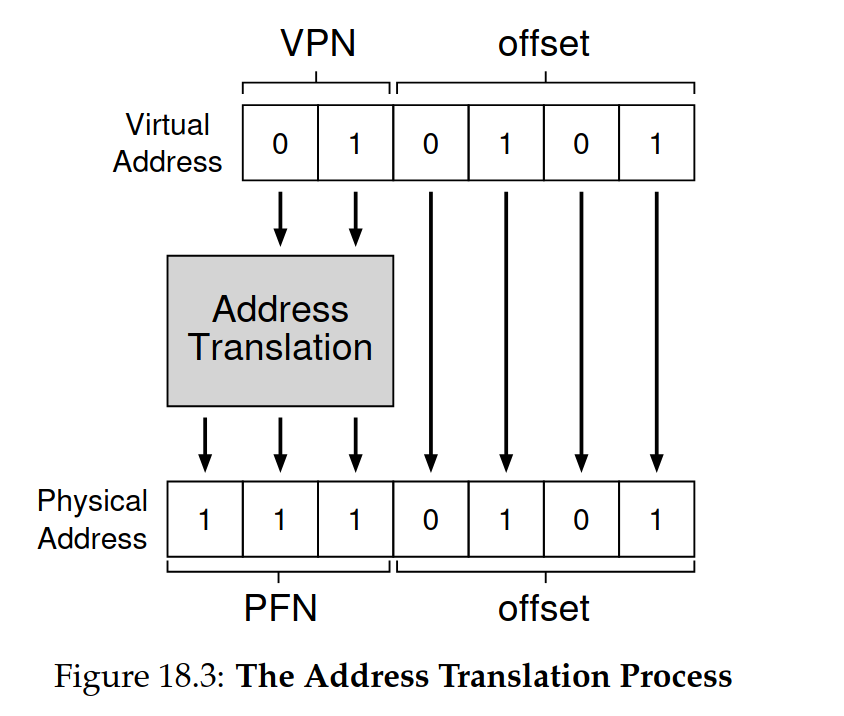

# 5. Memory

address space, kernel/user space, multiprogramming, stack/heap memory, malloc(), free(), valgrind, translation, relocation, base and bound/limit registers, segments, free list, bitmap, external/internal fragmentation, paging, offset, page, page frame, virtual/physical address, page table, page table entry (PTE), present/absent bit, referenced bit, modified/dirty bit, memory trace

## 5.1 Address Space

> The range of memory addresses that a process can use (virtual memory).

**Multiprogramming**: multiple processes run at the same time and the OS would
switch between them.

To achieve _interactivity_ in early days, time sharing would be implemented in
such a way the processes' state (memory) would be saved from memory to disk
which was **time consuming**.

Instead save the state of the process in memory and switch between them.

- Code: Instructions of the program
- Stack: To keep track of function calls
- Heap: Dynamically allocated memory

Virtualized memory because the program is not loaded in memory where it
thinks it is.

**Goals to virtualize memory**:

- Transparency: It should happen behind the scenes
- Efficiency: As possible, (i.e., not making programs run much more slowly) and space (i.e., not using too much memory)
- Protection: Isolation from other address spaces (_security_)

Exact memory:

## 5.2 Memory API

Stack vs Heap Memory

- Automatic memory on stack
  `int x;`
- Heap manually allocated (You are in charge of alloc and free!)
  `int _x = (int_) malloc(sizeof(int));`
- (Global variables in Data segment, not in Heap)

### Common Errors

- Forgetting To Allocate Memory
- Not ALlocating Enough Memory
- Forgetting To Initialize Allocated Memory
- Forgetting To Free Memory
  - -> Memory Leak
- Freeing Memory Too Soon
- Freeing Memory Twice

HOW TO EFFICIENTLY AND FLEXIBLY VIRTUALIZE MEMORY?:

## 5.3 Address translation

> the hardware transforms each memory access (e.g., an instruction fetch, load, or store), changing the virtual address provided by the instruction to a physical address where the desired information is actually located

^ Essential the hardware is responsible for translating the virtual address
The OS is responsible for managing the translation: keep track of which
locations are free and which are in use.

### Dynamic Relocation

We need two registers within the CPU: base and bounds registers
**Base Register**: the start of the process in physical memory
**Bounds Register:** the length of the process

The OS uses this formula to calculate the physical address:
$$ \text{Physical Address} = \text{Virtual Address} + \text{Base Register} $$

**free list**: a list of free memory blocks (e.g. 16KB-32KB, 48KB-64KB)

Specifically, when the OS decides to stop running a process, it must save the values of the base and bounds registers to memory,
in some per-process structure such as the process structure or process
control block (PCB).

To move a process's address space:

1. Deschedule the process
2. Copy address space from current location to new location
3. Update the base and bounds registers

## 5.4 Segmentation

> Segmentation is the division of a program's address space into segments, where each segment is a contiguous range of addresses with a specific purpose (code, stack, heap, etc.)

**code sharing**: multiple processes can share the same code segment

## 5.5 Free Space Management

**External Fragmentation**: when there are many small holes in memory, but not enough contiguous space to satisfy a request

Example:

**Internal Fragmentation**: when a process is allocated more memorythan it needs

### Bitmap

> A bitmap is a data structure that uses a single bit to represent the state of each block of memory: 0 means free, 1 means in use.

## 5.6 Paging

> Divide the address space into fixed-size blocks called pages, and divide physical memory into blocks of the same size called page frames.

With Paging, we achieve _flexibility_ and _efficiency_.

**Page table**: a data structure that maps virtual pages to physical page frames
(which the OS manages)

-> Helps with storing address translations

### Translation

To translate a virtual address to a physical address:

Split into two parts: VPN (Virtual Page Number) and Offset

Page Table Entry (PTE) format

- Present/Absent Bit: Is the page in memory or in disk?
- Protection Bits: Can the page be read, written, or executed?
- Reference Bits: Has the page been read or written to?
- Dirty Bit: Has the page been modified?
- Caching Bits: Should the page be cached?

Paging is both slow and takes too much space.

### Memory Trace

> A memory trace is a sequence of memory accesses made by a program, typically recorded in a file.

Example:

## Review questions and problems

1. When we have page-based memory management like we have learned about
   this week, what is the purpose of a bitmap? (what is it used for?)
   - A bitmap is used to keep track of which pages are in use and which are free.
2. What is in a pagetable entry? (in other words, what is the purpose each of the
   different bits or group of bits in a page table entry?)
   - Se above
3. Which of the following tasks are handled by hardware (not by the
   operating system or by the process)?

   - address translation
   - initialize trap table
   - initialize free list or bitmap
   - cpu caching

   -> address translation, cpu Caching

4. For each of the following three memory addresses
   (here given as decimal numbers), what will be the virtual page
   number and what will be the offset for page sizes of 4K and 8K:
   20000, 32769, 60000.

- For 4k:
  - 20000: VPN: 20000 // 4096 = 4, Offset: 20000 % 4096 = 3616
  - 32769: VPN: 32769 // 4096 = 8, Offset: 32769 % 4096 = 1
  - 60000: VPN: 60000 // 4096 = 14, Offset: 60000 % 4096 = 2656
- For 8k:
  - 20000: VPN: 20000 // 8192 = 2, Offset: 20000 % 8192 = 3616
  - 32769: VPN: 32769 // 8192 = 4, Offset: 32769 % 8192 = 1
  - 60000: VPN: 60000 // 8192 = 7, Offset: 60000 % 8192 = 2656

5. With 16-bits logical/virtual addresses, page size 4KB and this
   slightly simplified page table
   VPN PFN Present-bit
   +------+---+
   15 | 0000 | 0 |
   14 | 0110 | 1 |
   13 | 0111 | 1 |
   12 | 1011 | 1 |
   11 | 0000 | 0 |
   10 | 0000 | 0 |
   9 | 0010 | 1 |
   8 | 0001 | 1 |
   7 | 0000 | 0 |
   6 | 0000 | 0 |
   5 | 0000 | 0 |
   4 | 0000 | 0 |
   3 | 0000 | 0 |
   2 | 1111 | 1 |
   1 | 0011 | 1 |
   0 | 1100 | 1 |
   +----+---+

Explain how `0010 1101 1011 1010` is translated into a physical address.

1. First we need to know the length of the offset bit.

   - 4KB = 4096 bytes = 2^12 bits
   - OR just look at the highest index for the table -> 15; we need 4 bits for
     the VPN

2. Then we need to know the length of the VPN

   - 16 - 12 = 4 bits (first four bits)

3. VPN Offset
   0010 1101 1011 1010
4. VPN: 0010 = 2 (decimal) -> used as index in the page table -> PFN: 1111
5. Put PFN + Offset together: 1111 1101 1011 1010
