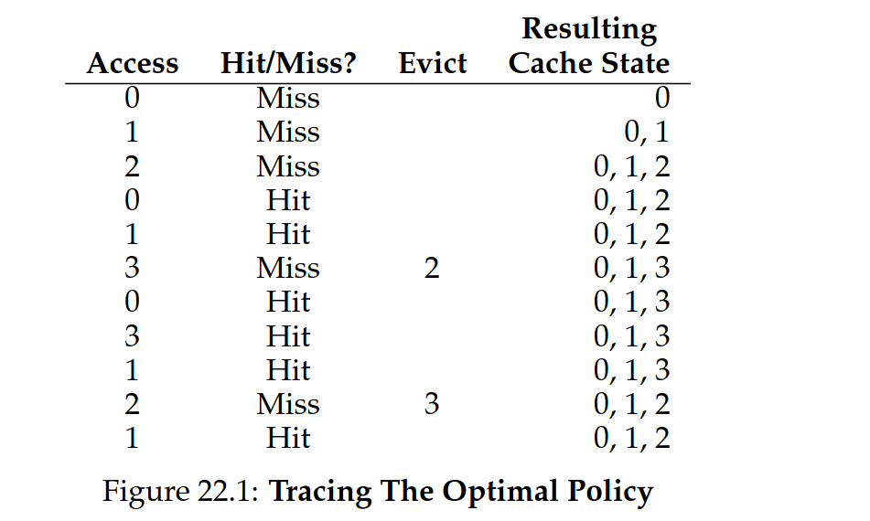

# 6. Memory Management

TLB, hit/miss, hit rate, temporal/spatial locality, TLB entry, ASID, multi-level page table, PTBR, PDBR, CR3, inverted page table, swap, page fault, minor/major page fault, optimal/fifo/random/LRU/clock page replacement, demand-paging vs pre-paging/pre-fetching, thrashing, working set, hugepages

To major issues with `Paging` are:

1. It is too slow, every memory access (also called a memory reference) leads to an
   extra memory access since the page table is stored in RAM; **Solved with TLB
   (translation lookaside buffer)**:
   - A part of the MMU
   - an _address-translation cache_ that stores the most recent translations
   - Such that the MMU can look up the translation in the TLB, instead of the page table (faster)
2. The page table is to big (takes up too much space in RAM), let’s solve this with
   one of
   - Multi-level page table (most used)
   - Inverted page table

### 6.1.1 TLB (Translation Lookaside Buffer)

Example:

```c
int i, sum = 0;
  for (i = 0; i < 10; i++) {
  sum += a[i];
}
```


_Elements that reside besides each other will get faster access times, because of the TLB-lookup._

Thus, our **TLB hit-rate** is 70% (7 out of 10 hits).

To take advantage of hardware caches, we need to exploit _locality_ (in instructions and references).

- **Temporal locality**: If you access a memory location, you are likely to access it again soon.
- **Spatial locality**: If you access a memory location, you are likely to access nearby memory locations soon.

TLBs rely on both temporal and spatial locality to achieve high hit rates.

### Who needs to handle TLB misses?

In old days, the hardware would handle it:

1. It needs to know _where_ the page table (via **page table register**) is stored in memory, and their _exact format_.
2. "Walk" the page table to find the correct entry and extract, and update TLB.

Modern CPUs use a **Hardware-managed TLB**:

1. The hardware raises an exception when a TLB miss occurs.
2. -> interrupt handler in the OS kernel is invoked to handle the miss.
3. the code will look up the correct entry in the page table and update the TLB.
4. and return

Advantages of this approach:

- The OS can decide how to handle TLB misses -- **flexibility**.
- The hardware doesn't do much -- **simplicity**.

### 6.1.2 TLB contents

Typical entry:

VPN | PPN | Other bits

- Other bits:
  - Valid bit: Is this entry valid traslation?
  - Protection bits: Can we read/write/execute this page?
  - etc.

When problem arises with TLB: **HOW TO MANAGE TLB CONTENTS ON A CONTEXT SWITCH?**

- Simply solution is to _flush_ the TLB on a context switch (setting all valid
  bits to 0 thus clearing out the TLB).

But flushing could introduce a performance penalty, so we have a better solution:

**ASID (Address Space Identifier)**


## 6.2 Smaller Page Tables

Trying to tackle huge memory usage.

_Bigger pages_ lead to internal fragmentation, _smaller pages_ lead to more page table entries.

### 6.2.1 Multi-level Page Table

Idea:

1. Chop up the page table into page-sized units.
2. Then, if an entire page (of page-table entries PTEs) is invalid, don't allocate that page of the page table at all
3. To track whether a page is valid or not, use a new structure called **Page Directory**.
4. The page directory thus either can be used to tell you where a page of the page table is, or that the entire page of the page table contains n valid pages


The page directory consist:

- a number of **page directory entries** (PDEs)

  - A PDE has a **valid bit** and a **Page frame number** (PFN) similar to a PTE.
  - however, the meaning of _valid bit_ is different here; it tells you whether the PDE points to a (at least) page of the page table or not.
    Multi-level pages have some advantages:

- **Compact**: only allocate page table entries when needed
- Each page fits nicely

Disadvantages:

- On a TLB miss two memory accesses are needed to find the PTE
- complexity


See theory about two levels.

### 6.2.2 Inverted Page Table

> Here, instead of having many page tables (one per process of the system), we keep a single page table that has an entry for each physical page of the system

_Cannot lookup, have to search the table for the entry.._

## 6.3 Swap Space

> When we run out of physical memory, we need to swap some pages out to disk.

First we need to **reserve** some space on the disk for this purpose, this is called the **swap space**.
Thus the OS will need to remember the **disk address** of a given page.


**Page fault**: when a process tries to access a page that is not in physical memory.

In that case, the OS will invoke **page fault handler**.

So how doe the OS know where to find the page on disk?:

1. It looks in the PTE for the disk address and issues I/O to disk
2. When the I/O is complete, the OS updates the PTE and the TLB (while the
   process is in _blocked_ state)


The process of picking a page to kick out, or replace is known as **page replacement policy**.


The OS ensure that there are pages higher than **Low watermark** but lower than
**High watermark**. Swap daemon is responsible for this.

## 6.4 Page Replacement Policies

**cache misses** that is, when we need to fetch a page from disk.

**Optimal policy**: Replace the page that will not be used for the longest time in the future.


Optimal is impossible to implement in practice, but it is useful for comparison.

### 6.4.1 FIFO (First-In-First-Out)


FIFO is simple to implement but not very good in practice.

### 6.4.2 Random


Random is simple to implement but not very good in practice.

### 6.4.3 LRU (Least Recently Used)


LRU is hard to implement in practice but is very good.

### 6.4.4 Workload


Workload with no locality is hard to predict.


### 6.4.5 Clock


Clock is a simple approximation of LRU. It is not as good as LRU but is much easier to implement.
Algorithm:

- When a page is accessed, set the reference bit to 1 (if it is not already 1)
- When a page is replaced, if the reference bit is 1, set it to 0 and move on to the next page (in a circular fashion)
- If the reference bit is 0, replace the page and set the reference bit to 1

### 6.4.6 Other Policies

**Demand Paging**: Only bring in pages when they are needed.
**pre-paging**: Bring in pages before they are needed (the OS tries to predict the future).

## 6.5 Thrashing

> When a system spends most of its time swapping pages in and out of memory, rather than executing code.

**Working set**: The set of pages that a process is actively using.

## 6.6 Linux VM

_kernel logical memory cannot be swapped to disk_
