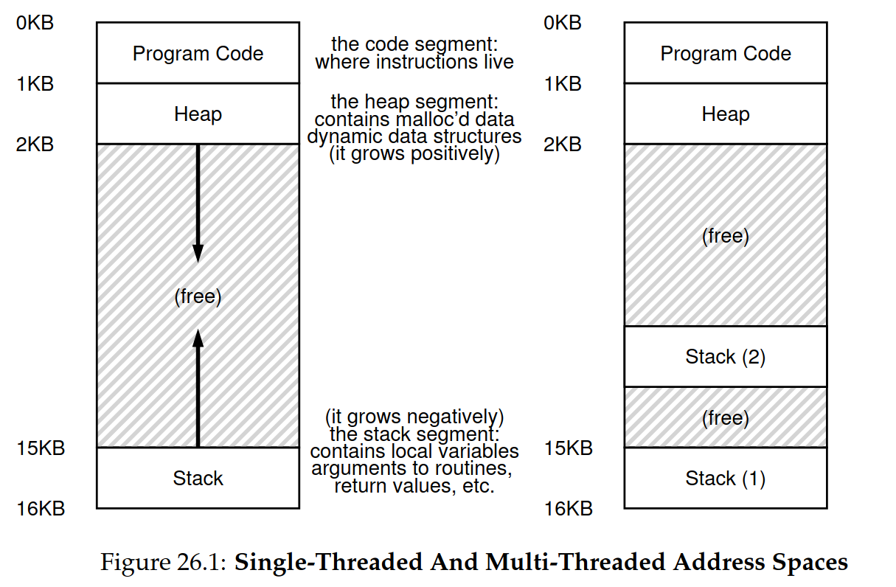
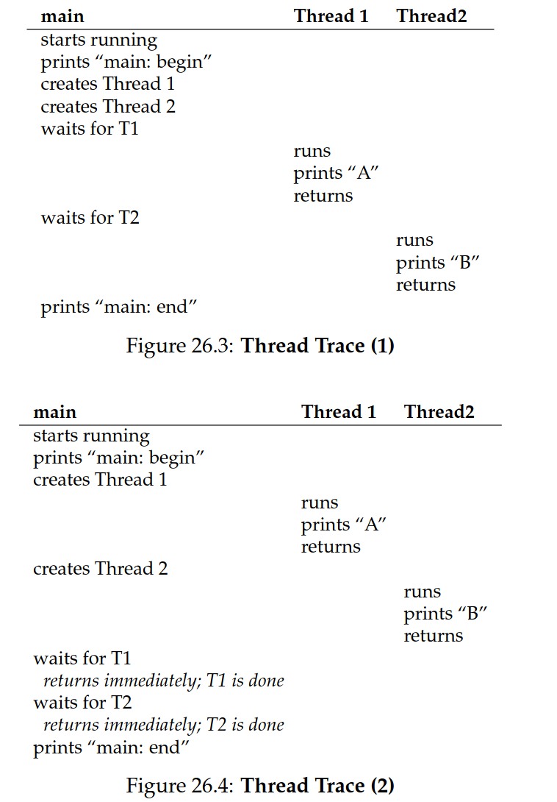
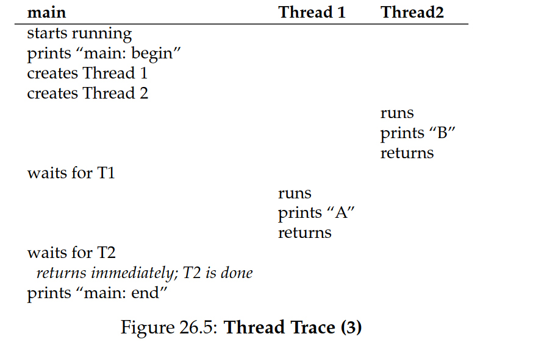
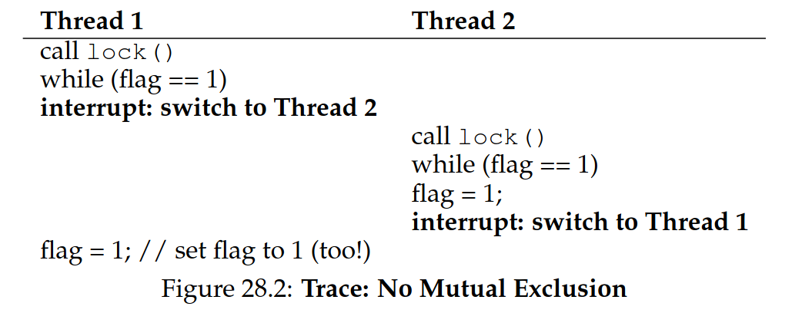
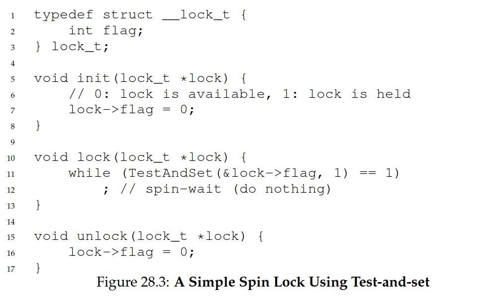
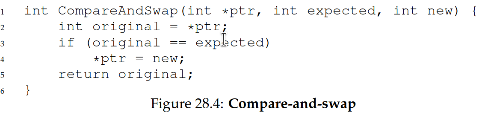

# 7 Threads and Locks

PCB vs TCB, single- vs multi-thread, pthread create/join, atomicity, critical section, race condition, deterministic, mutual exclusion, mutex lock, test-and-set, xchg, compare-and-swap, cmpxchg, lock prefix, spin/busy waiting, spin or switch, yield, two-phase lock

# 7.1 Introduction

A multi-threaded program has more than one point of execution (i.e., multiple
PCs)

Each thread is very much like a separate process, but sharing same address
space.

_Each thread has its own private set of registers it uses for computation_; thus, if there are two threads that are running on a single processor, when switching from running one (T1) to running the
other (T2), a context switch must take place. The context switch between
threads is quite similar to the context switch between processes, as the
register state of T1 must be saved and the register state of T2 restored before running T2. With processes, we saved state to a process control block (PCB); now, we’ll need one or more **thread control blocks (TCBs)** to store the state of each thread of a process.

- stack
- program counter / instruction pointer
- state
- registers

We don't need to switch page table between threads because they share the same.



^ Each thread has its own stack;

- Thus, any stack-allocated variables, parameters, return values, and other things that we put on the stack will be placed in
  what is sometimes called **thread-local storage**, i.e., the stack of the relevant thread

### Why use threads?

- **Parallelism**: multiple threads can run concurrently on multiple CPUs
  - **parallelization**: transform a single-threaded to work on multiple CPUs
- **overlapping I/O and computation**: while one thread is waiting for I/O, another can do computation

In other words, we use threads for ”_cooperative parallelism_”, while processes are used for separate tasks
that possibly compete.

## 7.1 pthread

```c
#include <assert.h>
#include <pthread.h>
#include <stdio.h>

void *mythread(void *arg) {
  printf("%s\n", (char *)arg);
  return NULL;
}

int main(int argc, char *argv[]) {
  pthread_t p1, p2;
  int rc;
  printf("main: begin\n");
  pthread_create(&p1, NULL, mythread, "A");
  pthread_create(&p2, NULL, mythread, "B");
  // join waits for the threads to finish
  pthread_join(p1, NULL);
  pthread_join(p2, NULL);
  printf("main: end\n");
}
```





^ Once a thread has been created, it may be executed immediately or at some later time.

### 7.2 Why it gets worse

```c
#include <pthread.h>
#include <stdio.h>

static volatile int counter = 0;

// mythread()
//
// Simply adds 1 to counter repeatedly, in a loop
// No, this is not how you would add 10,000,000 to
// a counter, but it shows the problem nicely.
//
void *mythread(void *arg) {
  printf("%s: begin\n", (char *)arg);
  int i;
  for (i = 0; i < 1e7; i++) {
    counter = counter + 1;
  }
  printf("%s: done\n", (char *)arg);
  return NULL;
}

// main()
//
// Just launches two threads (pthread_create)
// and then waits for them (pthread_join)
//
int main(int argc, char *argv[]) {
  pthread_t p1, p2;
  printf("main: begin (counter = %d)\n", counter);
  pthread_create(&p1, NULL, mythread, "A");
  pthread_create(&p2, NULL, mythread, "B");

  // join waits for the threads to finish
  pthread_join(p1, NULL);
  pthread_join(p2, NULL);
  printf("main: done with both (counter = %d)\n", counter);
  return 0;
}
```

### Race condition

> The results depend on the timing of the code's execution.
> ^ In the example above:

1. The main thread creates two threads, A and B.
2. Threads A and B both increment the shared variable counter.
3. Here the OS will invoke interrupts to switch between threads.
4. This results in a thread not being able to complete its increment operation before the other thread reads the value of counter.
5. Thus value of counter is not incremented correctly.

So: instead of a nice **deterministic computation** (which we are used to from computers), we call this result \*
**indeterminate**
where it is not known what the output will be and it is indeed likely to be
different across runs

_Because multiple threads executing this code can result in a race condition, we call this code a **critical section**_

- A **critical section** is a piece of code that accesses a shared variable (or more generally, a shared resource) and must not be concurrently executed by more than one thread

How to solve problem above: use **mutual exclusion**: that is, if a thread is executing in the critical section, prevent other from doing so.

**Atomicity** is the property of an operation that makes it indivisible, i.e., it cannot be interrupted.

## 7.2 Thread API

### 7.2.1 pthread_create

```c
#include <pthread.h>
int
pthread_create(pthread_t *thread,
                const pthread_attr_t *attr,
                void *(*start_routine)(void*),
                void *arg);
```

`void *(*start_routine)(void*)` is the function that the thread will run.

- With `void *arg` as its argument (any type) and `void *` as its return value
  (any type as well)

### 7.2.2 pthread_join

```c
typedef struct {
  int a;
  int b;
} myarg_t;
typedef struct {
  int x;
  int y;
} myret_t;

void *mythread(void *arg) {
  myret_t *rvals = malloc(sizeof(myret_t));
  rvals->x = 13213;
  rvals->y = 21;
  return (void *)rvals;
}

int main(int argc, char *argv[]) {
  pthread_t p;
  myret_t *rvals;
  myarg_t args = {10, 20};
  pthread_create(&p, NULL, mythread, &args);
  pthread_join(p, (void **)&rvals);
  printf("returned %d %d\n", rvals->x, rvals->y);
  free(rvals);
  return 0;
}
```

Attention to `rvals` being a pointer to a `myret_t` struct -- this is because we want to change the value.

### 7.2.3 pthread_mutex_lock

```c

static volatile int counter = 0;
pthread_mutex_t lock;

void *mythread(void *arg) {
  printf("%s: begin\n", (char *)arg);

  if (pthread_mutex_lock(&lock) != 0) {
    fprintf(stderr, "Error locking mutex\n");
    exit(EXIT_FAILURE);
  }

  for (int i = 0; i < 1e7; i++) {
    counter = counter + 1;
  }

  if (pthread_mutex_unlock(&lock) != 0) {
    fprintf(stderr, "Error unlocking mutex\n");
    exit(EXIT_FAILURE);
  }

  printf("%s: done\n", (char *)arg);
  return NULL;
}

int main(int argc, char *argv[]) {
  pthread_t p1, p2;

  if (pthread_mutex_init(&lock, NULL) != 0) {  }

  printf("main: begin (counter = %d)\n", counter);

  if (pthread_create(&p1, NULL, mythread, "A") != 0) {  }

  if (pthread_create(&p2, NULL, mythread, "B") != 0) {}

  if (pthread_join(p1, NULL) != 0) {}
  if (pthread_join(p2, NULL) != 0) {}

  if (pthread_mutex_destroy(&lock) != 0) {}

  printf("main: done with both (counter = %d)\n", counter);
  return 0;
}
```

Make sure to lock when reading and writing to shared variables.

### 7.2.4 Condition variables

```c
// Waiter
Pthread_mutex_lock(&lock);
while (ready == 0)
Pthread_cond_wait(&cond, &lock);
Pthread_mutex_unlock(&lock);
// Signaler
Pthread_mutex_lock(&lock);
ready = 1;
Pthread_cond_signal(&cond);
Pthread_mutex_unlock(&lock);
```

## 7.3 Locks

Design goals:

- **mutual exclusion**: only one thread can execute the critical section at a time
- **fairness**: if a thread is waiting to enter the critical section, it should eventually be able to do so
- **performance**: the overhead of acquiring and releasing the lock should be low

### Why don't use interrupts to lock and unlock?

Security, doesn't work on multiprocessors.

### Flags?



### Test-and-set

```c
 int TestAndSet(int *old_ptr, int new) {
  int old = *old_ptr; // fetch old value at old_ptr
  *old_ptr = new; // store ’new’ into old_ptr
  return old; // return the old value
 }
```



Though, this technique requires a _preemptive scheduler_ (to interrupt) or else will spin
forever.

#### Evaluating Spin Locks

- _correctness_?: yes, mutual exclusion is guaranteed
- _fairness_?: no, threads are not guaranteed to enter the critical section in the order they requested
- _performance_?: on single CPU, no; on multiple CPUs, yes

### Compare and Swap



---

**Yield**: relinquish the CPU to another thread (or process) that is ready to run.

-Moves the calling thread from _running_ state to _ready_ state.

**Deadlock:** When a set of threads/processes are ALL waiting for an event that only one of them
can trigger...

## Review Questions and Problems

1. What is stored in a thread control block (TCB)?

- Location of stack  
- State (running, ready, blocked)
- Registers

2. (**KEY PROBLEM**) Exercises in ch. 27

```c
#include <stdio.h>
#include "common_threads.h"

pthread_mutex_t m1 = PTHREAD_MUTEX_INITIALIZER;
pthread_mutex_t m2 = PTHREAD_MUTEX_INITIALIZER;

void* worker(void* arg) {
    if ((long long) arg == 0) {
 Pthread_mutex_lock(&m1);
 Pthread_mutex_lock(&m2);
    } else {
 Pthread_mutex_lock(&m2);
 Pthread_mutex_lock(&m1);
    }
    Pthread_mutex_unlock(&m1);
    Pthread_mutex_unlock(&m2);
    return NULL;
}

int main(int argc, char *argv[]) {
    pthread_t p1, p2;
    Pthread_create(&p1, NULL, worker, (void *) (long long) 0);
    Pthread_create(&p2, NULL, worker, (void *) (long long) 1);
    Pthread_join(p1, NULL);
    Pthread_join(p2, NULL);
    return 0;
}
```

<script type="text/javascript" src="http://cdn.mathjax.org/mathjax/latest/MathJax.js?config=TeX-AMS-MML_HTMLorMML"></script>
<script type="text/x-mathjax-config">
    MathJax.Hub.Config({ tex2jax: {inlineMath: [['$', '$']]}, messageStyle: "none" });
</script>
