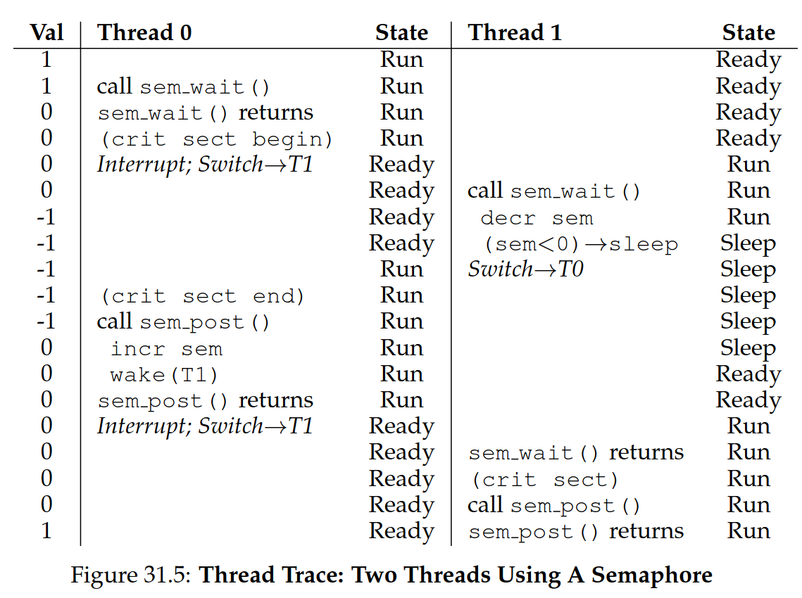
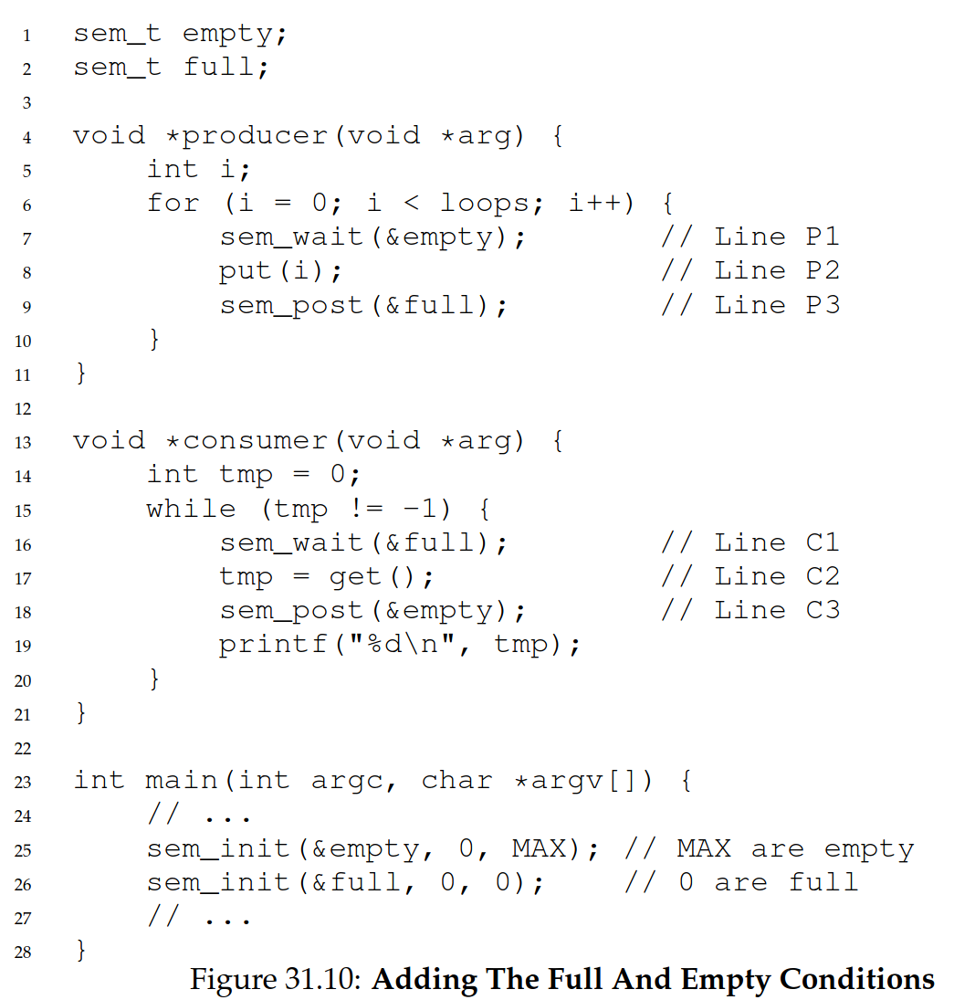
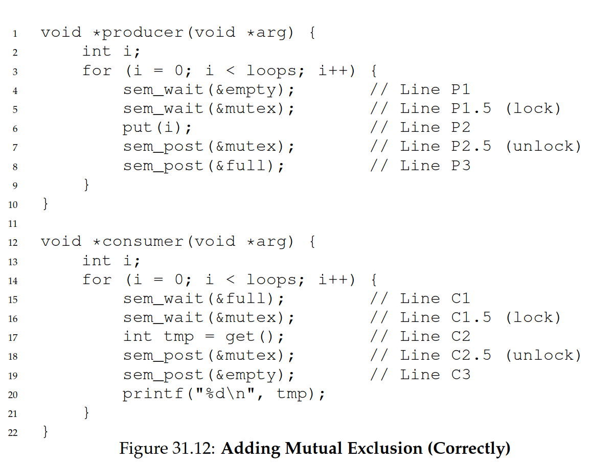
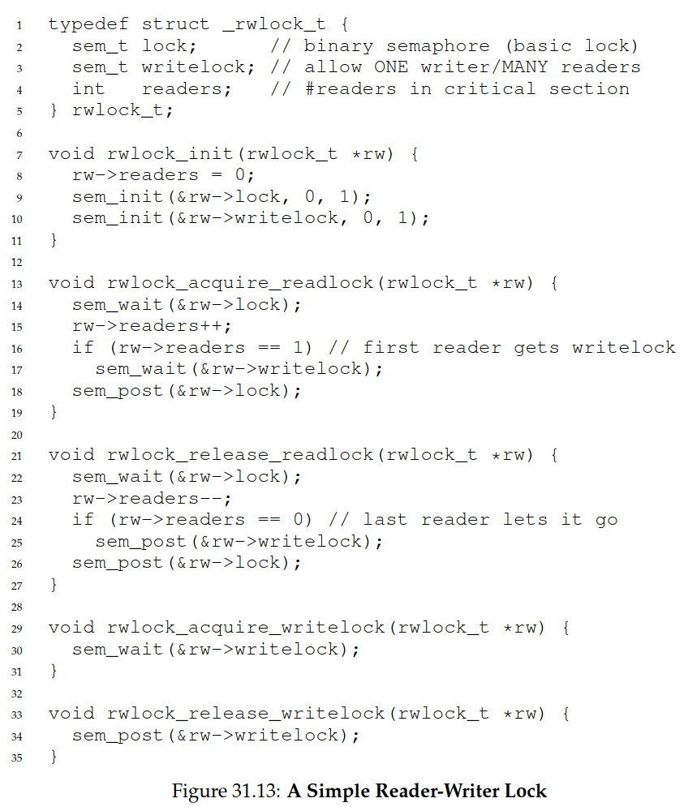

# 8. Condition Variables and Semaphores

pthread cond_wait/cond_signal, producer-consumer, semaphore, sem_wait (down), sem_post (up), binary semaphore, ordering/synchronizing semaphore, reader-writer, starvation, dining philosophers, barrier, monitor, deadlock

> How do we notify the parent thread of a child thread's completion?

**condition variable:** How can threads wait on some condition that another thread will trigger?

```c
int done = 0;
pthread_mutex_t m = PTHREAD_MUTEX_INITIALIZER;
pthread_cond_t c = PTHREAD_COND_INITIALIZER;

void thr_exit() {
  Pthread_mutex_lock(&m);
  done = 1;
  Pthread_cond_signal(&c);
  Pthread_mutex_unlock(&m);
}

 void *child(void *arg) {
  printf("child\n");
  thr_exit();
  return NULL;
}

 void thr_join() {
  Pthread_mutex_lock(&m); // Need to lock to check 'done'
  while (done == 0)
  Pthread_cond_wait(&c, &m); // While waiting, release the lock such that other
                                                //threads can access it. After signal, reacquire the lock
  Pthread_mutex_unlock(&m);
}

 int main(int argc, char *argv[]) {
  printf("parent: begin\n");
  pthread_t p;
  Pthread_create(&p, NULL, child, NULL);
  thr_join();
  printf("parent: end\n");
  return 0;
}
```

## 8.1 Producer-Consumer Problem

> A _Producer_ puts items in a buffer, a _Consumer_ removes items from the same buffer

## 8.2 Semaphores

> A semaphore is an object with an integer value (as opposed to a condition variable) that we can manipulate with two routines

```c
#include <semaphore.h>
sem_t s;
sem_init(&s, 0, 1); // Initialize semaphore with value 1, 0 for shared between threads
```

#### def. of wait and post

```c
int sem_wait(sem_t *s) {
  // decrement the value of semaphore s by one
  // wait if value of semaphore s is negative
}

int sem_post(sem_t *s) {
  // increment the value of semaphore s by one
  // if there are one or more threads waiting, wake one
}
```

#### Binary Semaphore (a lock mutex)

```c
sem_t m;
sem_init(&m, 0, X); // init to X; what should X be?

sem_wait(&m);
// critical section here
sem_post(&m);
```







#### Reader-writer lock



## Review Questions and Problems

1. What is spin wait / busy waiting?
   - Spin waiting is simply a loop that repeatedly checks a condition. It is not efficient as it consumes CPU cycles and is not guaranteed to be fair.
2. In the Producer-Consumer problem, what is the purpose of the mutex/binary semaphore and what is the purpose of the counting semaphore(s)?
   - The mutex/binary semaphore is used to gurrante mutual exclusion when
     putting or removing items from the buffer. The counting semaphore reflects
     on how many items are in the buffer (thus, several consumers can consume)
3. Consider the following code:

```c
void *consumer(void *arg) {
  int i;
  for (i=0;i<5;i++) {
    pthread_mutex_lock(&mutex);
    if (state == EMPTY)
      pthread_cond_wait(&signalS, &mutex);

 <something something ...>

    pthread_cond_signal(&signalS);
    pthread_mutex_unlock(&mutex);
  }
  pthread_exit(NULL);
}
```

What is the purpose of the wait and signal operations in the code. What is the purpose of the variable mutex and why does it occur in the wait operation?

- Wait - we are waiting for the state to no be EMPTY
- Signal - we are waiting for a signal to arrive
- Mutex - because we are accessing shared data (state). Also since we just
  acquired the lock (mutex), we need to release it before waiting.

4. `writeloop.c`

```c
#include <pthread.h>
#include <stdio.h>
#include <stdlib.h>
#include <unistd.h>

int g_ant = 0;                                  /* global declaration */
pthread_mutex_t lock;                           /* mutex declaration */
pthread_cond_t cond = PTHREAD_COND_INITIALIZER; /* condition variable */
int turn = 0; /* turn variable: 0 for main, 1 for thread */

void *writeloop(void *arg) {
  char *msg = (char *)arg;

  while (g_ant < 10) {
    pthread_mutex_lock(&lock); /* lock the mutex */

    while ((turn == 0 && msg != "main") || (turn == 1 && msg != "thread")) {
      pthread_cond_wait(&cond, &lock); /* wait for the right turn */
    }
    if (g_ant == 10) {
      pthread_mutex_unlock(&lock); /* unlock the mutex */
      break;
    }
    g_ant++;
    usleep(rand() % 10); /* small random delay */
    printf("%s: %d\n", msg, g_ant);

    /* Switch turn after printing */
    turn = (msg == "main") ? 1 : 0;

    pthread_cond_signal(&cond);  /* signal the other thread */
    pthread_mutex_unlock(&lock); /* unlock the mutex */
  }

  return NULL;
}

int main(void) {
  pthread_t tid;

  pthread_mutex_init(&lock, NULL); /* initialize the mutex */

  /* Create a new thread for writeloop */
  pthread_create(&tid, NULL, writeloop, (void *)"thread");
  writeloop("main"); /* main thread also runs writeloop */

  pthread_join(tid, NULL); /* wait for the new thread to finish */

  pthread_mutex_destroy(&lock); /* destroy the mutex */
  pthread_cond_destroy(&cond);  /* destroy the condition variable */

  return 0;
}
```

5. Solve readers-writers problem with semaphores (no starvation)

```c
#include <stdio.h>
#include <stdlib.h>
#include <unistd.h>

#include "common_threads.h"

#ifdef linux
#include <semaphore.h>
#elif __APPLE__
#include "zemaphore.h"
#endif

#define MAX_MOD_READ 100
#define MAX_MOD_WRITE 100

typedef struct _rwlock_t {
  sem_t writelock;
  sem_t turnstile;
  sem_t lock;
  int readers;
} rwlock_t;

void rwlock_init(rwlock_t *lock) {
  lock->readers = 0;
  Sem_init(&lock->lock, 1);
  Sem_init(&lock->writelock, 1);
  Sem_init(&lock->turnstile, 1);
}

void rwlock_acquire_readlock(rwlock_t *lock) {
  Sem_wait(&lock->turnstile);
  Sem_post(&lock->turnstile);
  Sem_wait(&lock->lock);
  lock->readers++;
  if (lock->readers == 1)
    Sem_wait(&lock->writelock);
  Sem_post(&lock->lock);
}

void rwlock_release_readlock(rwlock_t *lock) {
  Sem_wait(&lock->lock);
  lock->readers--;
  if (lock->readers == 0)
    Sem_post(&lock->writelock);
  Sem_post(&lock->lock);
}

void rwlock_acquire_writelock(rwlock_t *lock) {
  Sem_wait(&lock->turnstile);
  Sem_wait(&lock->writelock);
}
void rwlock_release_writelock(rwlock_t *lock) {
  Sem_post(&lock->writelock);
  Sem_post(&lock->turnstile);
}

int loops;
int value = 0;

rwlock_t lock;

void *reader(void *arg) {
  int i;
  for (i = 0; i < loops; i++) {
    rwlock_acquire_readlock(&lock);
    printf("reader %ld reads %d\n", (intptr_t)arg, value);
    usleep(random() % MAX_MOD_READ);
    rwlock_release_readlock(&lock);
    usleep(random() % MAX_MOD_READ);
  }
  return NULL;
}

void *writer(void *arg) {
  int i;
  for (i = 0; i < loops; i++) {
    rwlock_acquire_writelock(&lock);
    value++;
    printf("writer %ld writes %d\n", (intptr_t)arg, value);
    usleep(random() % MAX_MOD_WRITE);
    rwlock_release_writelock(&lock);
    usleep(random() % MAX_MOD_WRITE);
  }
  return NULL;
}

int main(int argc, char *argv[]) {
  assert(argc == 4);
  int num_readers = atoi(argv[1]);
  int num_writers = atoi(argv[2]);
  loops = atoi(argv[3]);

  pthread_t pr[num_readers], pw[num_writers];

  rwlock_init(&lock);

  printf("begin\n");

  intptr_t i;
  for (i = 0; i < num_readers; i++)
    Pthread_create(&pr[i], NULL, reader, (void *)i);
  for (i = 0; i < num_writers; i++)
    Pthread_create(&pw[i], NULL, writer, (void *)i);

  for (i = 0; i < num_readers; i++)
    Pthread_join(pr[i], NULL);
  for (i = 0; i < num_writers; i++)
    Pthread_join(pw[i], NULL);

  printf("end: value %d\n", value);

  return 0;
}
```

#### Throttle

```c
#include <stdio.h>
#include <stdlib.h>
#include <pthread.h>
#include <unistd.h>

#include "common.h"
#include "common_threads.h"

#ifdef linux
#include <semaphore.h>
#elif __APPLE__
#include "zemaphore.h"
#endif

sem_t s;

void *child(void *arg) {
    Sem_wait(&s);
    printf("child %lld\n", (long long int) arg);
    sleep(1);
    Sem_post(&s);
    return NULL;
}

int main(int argc, char *argv[]) {
    if (argc != 3) {
        fprintf(stderr, "usage: throttle <num_threads> <sem_value>\n");
        exit(1);
    }
    int num_threads = atoi(argv[1]);
    int sem_value = atoi(argv[2]);

    Sem_init(&s, sem_value);

    printf("parent: begin\n");
    pthread_t c[num_threads];

    int i;
    for (i = 0; i < num_threads; i++)
        Pthread_create(&c[i], NULL, child, (void *) (long long int)i);

    for (i = 0; i < num_threads; i++)
        Pthread_join(c[i], NULL);

    printf("parent: end\n");
    return 0;
}
```

child 1 will run first, then child 2, then child 3, etc.
