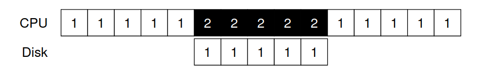
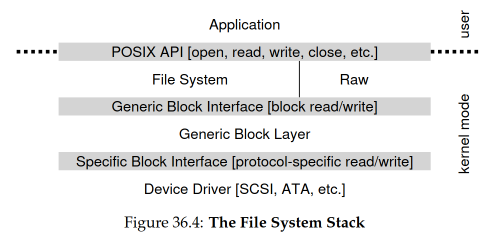

# 9. I/0 and HDD/SSD

Memory and I/O buses/interconnect, PCI/USB/SATA, micro-controller, I/O device, programmed I/O, interrupt-based I/O, DMA, I/O instructions (isolated I/O), memory-mapped I/O, I/O stack, block device, storage stack, block addresses, sector, HDD, platter, surface, spindle, RPM, track, cylinder, disk arm, disk head, seek time, rotational delay, SSD, SLC/MLC/TLC, NAND flash, flash translation layer, trim, write amplification, wear levelling, RAID 0/1/5, iops, sequential/random read/write

## 9.1 Input / Output


^ Why do we need this hierarchy?

> Because of physics (for high-performance) and cost.


**DMI**: Direct Media Interface
**eSATA**: External SATA (Serial ATA) (ATA: AT Attachment)

---


^ The first is the **hardware interface** that it provides.
^ Second is the **internals**, that is implement-specific (containing firmware
etc)

```c
While (STATUS == BUSY)
; // wait until device is not busy
Write data to DATA register
Write command to COMMAND register
(starts the device and executes the command)
While (STATUS == BUSY)
; // wait until device is done with your request
```

^ Typical how the OS communicates with the device.

When the main CPU is involved in the data movement, it is called **programmed I/O**.

^ This implementation (polling) is not efficient, because the CPU is waiting for the device

> Instead, we can use **interrupts**, which lets the calling process to sleep.

That is, we go from this:


To this:



**However**:

> If a device is fast, it may be best to _poll_; if it is slow, _interrupts_, which allows for overlaps

And if the device is both fast and slow, it may be best to use a **hybrid** approach where

> Poll for a little, if it's not finished, then sleep and wait for an interrupt.

---


^ When the CPU is moving data to and from Memory, it's quite slow

Instead we can use **DMA** (Direct Memory Access), where the device can directly access the memory

With DMA:


It works as follows:

1. The CPU tells the DMA engine where data lives in memory, how much data to move, and which device to send it to.
2. When the DMA is complete, the DMA controller raises an interrupt and the OS knows the transfer is complete.

---

How to communicate with the device?

1. The oldest way is to use **I/O instructions** (isolated I/O) (in/out instructions)

   - use `in` and `out` instructions with an address space based on ports (similar to TCP/UDP ports)

2. **Memory-mapped I/O**:
   - use physical addresses (those not used by RAM) and map those to registers on I/O-devices, then we can reuse instructions like `mov`

---

How to fit ever device into the OS (each with its own interface)

We used the good-old technique called **abstraction**:

- We create a **device driver** for each device



## 9.2 Storage

#### Addressing

The (HDD) drive consist of a large number of _n_ **sectors** (512 bytes blocks) that are numbered from 0 to _n-1_.

This is the **address space** of the drive.

### 9.2.1 HDD


A HDD consists of:

- platter with surface grouped in a spindle
- rotation measured in RPM
- a circle on a surface is a track, the set of all tracks above each other is a cylinder
- a disk arm accesses a sector with its disk head
- each platter have two surfaces, there are many platters and each platter have
  a disk arm for top and bottom surface
- e.g. eight platters with two surfaces means 16 disk arms (they all move to-
  gether, not independently)

#### HDD Access Times

- **Seek time**: time to move the disk arm to the right track
- **Rotational delay**: time to wait for the sector to rotate under the head
- **Accessing Sectors**: time to read/write the sector

Total time = $T_{I/O} = T_{seek} + T_{rotational} + T_{transfer}$


#### Calculations

Compute $T_{rotation}$ for a 7200 RPM:

$T_{rotation} = \frac{1 minute}{7200 rot} \cdot \frac{60 seconds}{1 minute} \cdot \frac{1000 ms}{1 seconds} = \frac{8.33 ms}{rot}$

Given transfer rate of 100 MB/s, calculate how long it takes to transfer 512 KB block in ms:

$\frac{ms}{1 request} = \frac{512 KB}{1 request} \cdot \frac{1 MB}{1024 KB} \cdot \frac{1 s}{100MB} \cdot \frac{1000ms}{1 second} = \frac{5ms}{request}$


---

### 9.2.2 SSD


> **Solid State Drive**
>
> - No moving parts
> - Faster than HDD
> - More expensive
> - Limited write cycles

#### 9.2.2.1. Storing bits

- **SLC (Single Level Cell)**: 1 bit per transistor
- **MLC (Multi Level Cell)**: 2 bits per transistor
- **TLC (Triple Level Cell)**: 3 bits per transistor

---

**Three low-level mechanisms**

- **Read**: read a page
- **Erase**: (before writing) erase a block
- **Program**: write a sector


---


**Major issues with SSDs**

- **Wear out**: limited number of write cycles
- **Disturbance**: when writing to a cell, the surrounding cells may be disturbed

---


- **FTL**: Flash Translation Layer (maps logical addresses to physical addresses)
  - should be fast and reliable

For even better performance, we can use **parallelism** of the flash chips.

Another performance goal is to reduce **write amplification** (the amount of data written to the flash memory is more than the amount of data written by the host)

**wear leveling**: spread out the writes over the entire disk to reduce wear out (done so by the _FTL_)

**direct mapped FTL**: is bad in terms of performance and reliability.

## Summary


