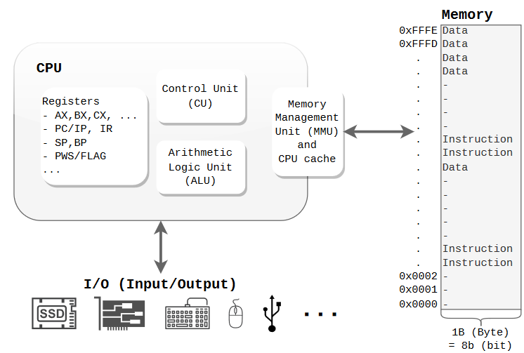
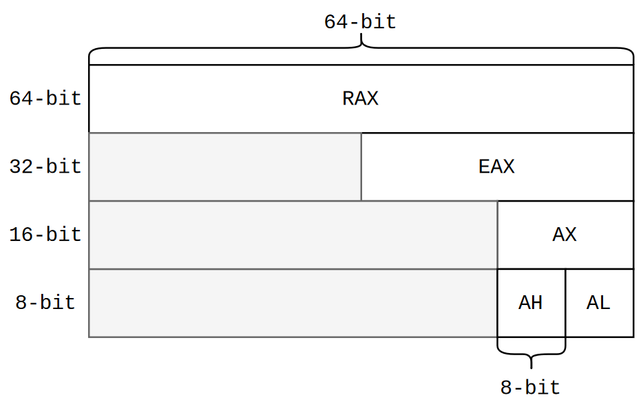
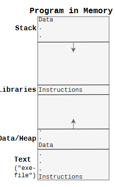

# Chapter 1

## 1.1 Computer Architecture

#### CPU, Memory, I/O Devices



- CPU: - the brain of the computer
  - ALU: Arithmetic Logic Unit - performs arithmetic and logical operations on
    binary numbers
  - MMU - Memory Management Unit - responsible for managing memory accesses
  - CU - Control Unit - controls the data flow and prepares stuff for ALU to execute
  - Registers - small, fast storage locations in the CPU
    - AX. BX, CX. DX. SP. BP. SI, DI Data Registers - stores variables,
      arguments and return values etc.
    - IP/PC - Instruction Pointer/Program Counter - stores the address of the
      next instruction to be executed
    - IR - Instruction Register - stores the current instruction being executed
      by ALU
    - SP - Stack Pointer - points to the top of the stack
    - BP - Base Pointer - points to the base of the stack; a stack frame is
      created for each function call and deleted when the function returns
    - FLAG/PSW - Flag Register/Program Status Word - contains control/status
      information about the CPU
- Memory/RAM - Random Access Memory - running programs are loaded here and they
  contain instructions and data. _Every address into memory goes to a Byte, not
  a bit or a word_
- I/O-devices - are connected to the computer's central bus and are used by the
  CPU to get info out and in of the computer.

### 1.1.1 Register



A register can be used in 8-bit, 16-bit, 32-bit or 64-bit mode.
**If it starts with:**

- R - 64-bit (e.g. RAX, RIP, RSP)
- E - 32-bit (e.g. EAX, EIP, ESP)
  We rarely see 16- and 8-bit registers in modern computers.

### 1.1.2 ISA (Instruction Set Architecture / Microarchitecture)

- native data types and instructions that a processor can execute
- registers
- addressing modes
- memory architecture
- interrupt and exception handling
- external I/O

Each ISA has a specific set of instructions it can execute.

We are interested in what we can use directly to program on the lowest possible
level -> we use the symbolic representation of the machine instructions:
**Assembly code.**

#### Regular instructions

The most common instructions are:

- Move/Copy data `mov`
- Math functions `add`, `sub`
- Function related `call`, `ret`
- Jumping `jmp`, `je` (jump if equal), `jne` (jump if not equal)
- Comparing `cmp`
- Stack related `push`, `pop`

### 1.1.3 How CPU works

CPU Workflow (simplified):

```c
while(not HALT) { # while powered on
  IR=Program[PC]; # fetch instruction pointed to by PC to IR
  PC++; # increment PC (program counter aka IP)
  execute(IR); # execute instruction in IR
}
```

Instruction cycle: _fetch, (decode), execute_

### 1.1.4 Interrupts

CPU Workflow - with interrupts:

````c
```c
while(not HALT) {
  IR = mem[PC]; # IR = Instruction Register
  PC++; # PC = Program Counter (register)
  execute(IR);
  if(IRQ) { # IRQ = Interrupt ReQuest
    savePC();
    loadPC(IRQ); # Hopper til Interrupt-rutine
  }
}
````

I/O devices will generate an _interrupt_ to the CPU when they want the
attention. Then the CPU will stop what it's doing and execute a specific piece
of code to handle the interrupt. Since they can happen at any time, they are
called _asynchronous interrupts_.

**Registers vs RAM** Register contents _belong to the current running program
and the OS_

#### A Program in Memory



- **Text** - contains the program's instructions
- **Data/Heap** - (grows upwards)- contains _global variables, local static
  variables_ (e.g. `static int x:`) _dynamically allocated memory (e.g. `malloc`)_

- **Libraries** - e.g. _libc_. We actually _point to the library_ because all
  the programs would share this library in memory to **save space**.

- **Stack** - (grows downwards) - contains _local automatic variables, return
  addresses_ and sometimes _function arguments_.

**_NOTE:_** If _grows upwards_ -> addresses increase, if _grows downwards_ ->
addresses decrease; such that the stack and heap don't collide. If the both meet
-> the program will crash. To maximize the available memory.

## 1.2 Software

### 1.2.1 Compiling
